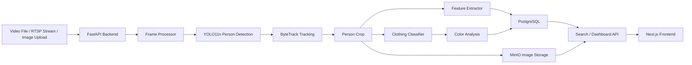
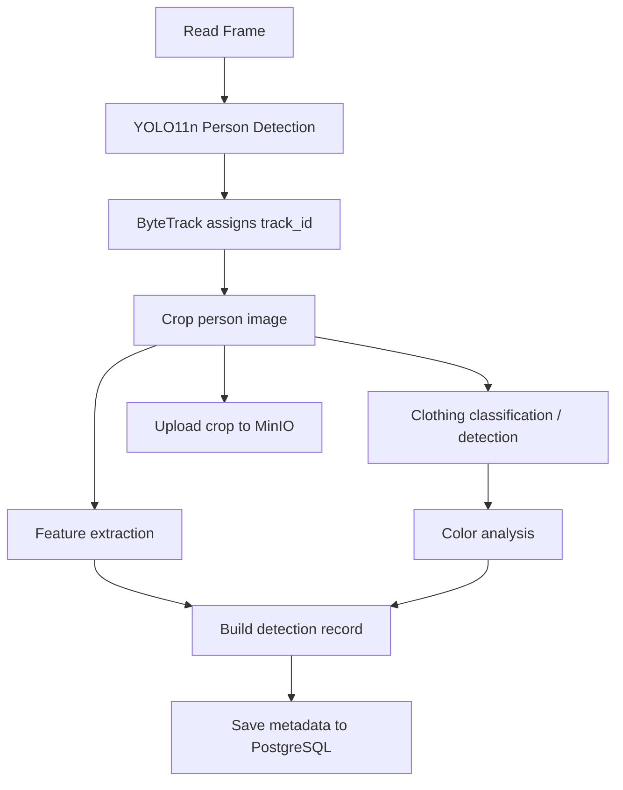
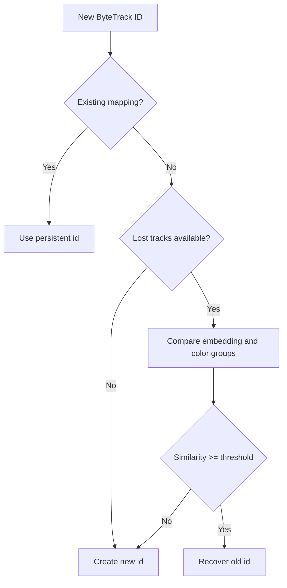
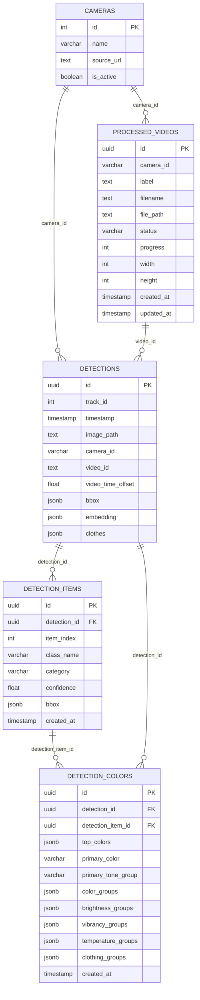
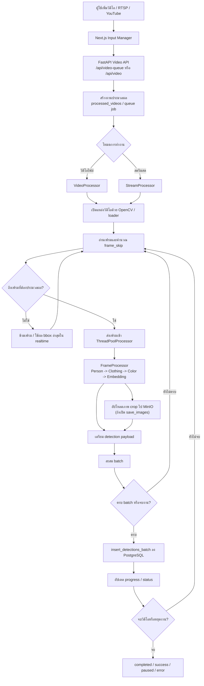
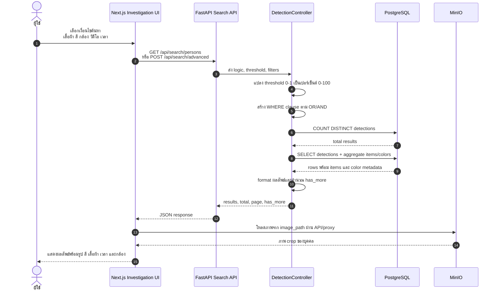
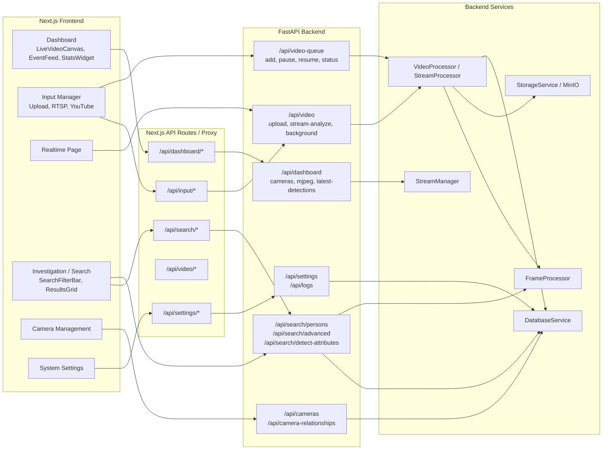
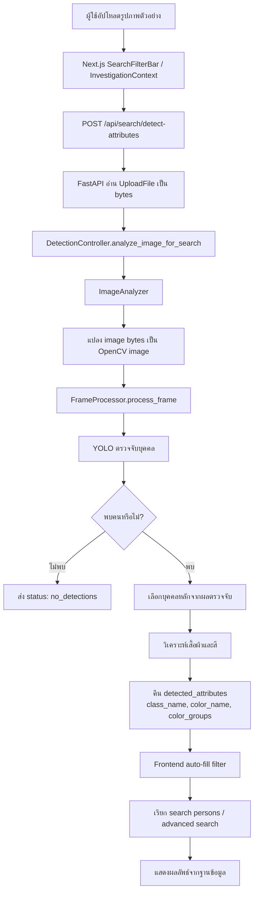

# บทที่ 3 วิธีดำเนินโครงงาน

ในบทนี้จะอธิบายถึงขั้นตอนและวิธีการที่ใช้ในการออกแบบและพัฒนาระบบช่วยค้นหาและติดตามบุคคลจากภาพกล้องวงจรปิดด้วยปัญญาประดิษฐ์ โดยจะกล่าวถึงภาพรวมของระบบ สถาปัตยกรรมหลัก ความต้องการของระบบ การออกแบบกระบวนการประมวลผลภาพ การออกแบบฐานข้อมูล การพัฒนาส่วน backend และ frontend การทดสอบระบบ ตลอดจนแนวทางการนำระบบไปใช้งาน เพื่อให้เห็นกระบวนการพัฒนาทั้งหมดอย่างเป็นลำดับและสามารถตรวจสอบย้อนกลับได้

โครงสร้างของบทนี้แบ่งออกเป็นหัวข้อย่อยดังนี้

1. ภาพรวมของระบบ (System Overview)
2. การวิเคราะห์ความต้องการ (Requirements Analysis)
3. การออกแบบระบบ (System Design)
4. การพัฒนาระบบ (System Implementation / Development Process)
5. การรวมระบบเว็บ (Web Integration)
6. การทดสอบระบบ (System Testing)
7. การนำระบบขึ้นใช้งาน (Deployment)

## 3.1 ภาพรวมของระบบ (System Overview)

### 3.1.1 แนวคิดสถาปัตยกรรมโดยรวม (Overall Architecture Concept)

ระบบที่พัฒนาขึ้นเป็นเว็บแอปพลิเคชันสำหรับช่วยค้นหาบุคคลจากฟุตเทจกล้องวงจรปิด โดยมีเป้าหมายเพื่อลดระยะเวลาที่ต้องใช้ในการตรวจสอบวิดีโอด้วยมนุษย์ และลดโอกาสผิดพลาดจากการค้นหาข้อมูลจำนวนมาก ระบบถูกออกแบบให้ผู้ใช้งานสามารถนำวิดีโอหรือสตรีมจากกล้องเข้าสู่ระบบ จากนั้นระบบจะตรวจจับบุคคล ติดตามรหัสบุคคล วิเคราะห์ประเภทเสื้อผ้า วิเคราะห์สี และจัดเก็บผลลัพธ์เพื่อให้ค้นหาย้อนหลังได้

สถาปัตยกรรมของระบบใช้แนวคิด Client-Server และแบ่งการทำงานออกเป็นหลายชั้น ได้แก่ ชั้นนำเสนอผล (Presentation Layer) ที่พัฒนาด้วย Next.js, ชั้นประมวลผลและให้บริการ API (Application Layer) ที่พัฒนาด้วย FastAPI และ Python, ชั้นประมวลผลภาพด้วยโมเดล AI (AI Processing Layer) ที่ใช้ YOLO11, ByteTrack, OpenCV และ PyTorch และชั้นจัดเก็บข้อมูล (Data Layer) ที่ใช้ PostgreSQL สำหรับ metadata และ MinIO สำหรับจัดเก็บภาพ crop ของบุคคล

การแยกความรับผิดชอบออกเป็นชั้นดังกล่าวช่วยให้ระบบสามารถพัฒนาและบำรุงรักษาได้ง่ายขึ้น เช่น การปรับปรุงโมเดล AI โดยไม่กระทบส่วนติดต่อผู้ใช้ การปรับปรุงฐานข้อมูลโดยไม่ต้องแก้ไขขั้นตอนประมวลผลภาพทั้งหมด หรือการเพิ่มหน้าจอค้นหาใหม่โดยเรียกใช้ API เดิมที่มีอยู่แล้ว

### 3.1.2 แผนภาพสถาปัตยกรรมส่วนประกอบ

ภาพที่ 3.1 ควรแสดงสถาปัตยกรรมโดยรวมของระบบ โดยประกอบด้วยส่วนรับข้อมูล ส่วนประมวลผล AI ส่วน backend/API ส่วนฐานข้อมูลและ object storage และส่วน frontend



ภาพที่ 3.1 แผนภาพสถาปัตยกรรมส่วนประกอบของระบบ

ตารางที่ 3.1 คำอธิบายส่วนประกอบหลักของระบบ

| ส่วนประกอบหลัก | เทคโนโลยีที่ใช้ | หน้าที่หลัก |
|---|---|---|
| Frontend Server | Next.js 15, React 19, TypeScript, Tailwind CSS | แสดงผล dashboard, realtime view, search, investigation และ camera management |
| Backend/API Server | FastAPI, Uvicorn, Python | ให้บริการ API สำหรับอัปโหลดวิดีโอ วิเคราะห์ภาพ ค้นหา จัดการกล้อง และส่งข้อมูลให้ frontend |
| AI Processing Layer | YOLO11n, ByteTrack, OpenCV, PyTorch | ตรวจจับบุคคล ติดตาม track id ตรวจจับ/จำแนกเสื้อผ้า วิเคราะห์สี และดึง feature vector |
| Database Server | PostgreSQL | เก็บข้อมูล metadata เช่น camera id, track id, bbox, class เสื้อผ้า, สี, embedding และสถานะวิดีโอ |
| Object Storage | MinIO | เก็บภาพ crop ของบุคคลหรือภาพ bbox ที่ได้จากการตรวจจับ |
| Video/Input Service | OpenCV, vidgear, yt-dlp, HLS.js | รองรับการนำเข้าวิดีโอ ไฟล์อัปโหลด RTSP stream และ YouTube/stream input |

## 3.2 การวิเคราะห์ความต้องการ (Requirements Analysis)

หัวข้อนี้มีจุดประสงค์เพื่อระบุปัญหา ข้อจำกัด และความต้องการของระบบใหม่ เพื่อให้การพัฒนาระบบช่วยค้นหาบุคคลจากกล้องวงจรปิดเป็นไปตามเป้าหมายของโครงงาน

### 3.2.1 ความต้องการทั่วไป (General Requirements)

ระบบต้องสามารถรับข้อมูลภาพและวิดีโอจากหลายแหล่ง เช่น ไฟล์วิดีโอที่อัปโหลด สตรีม RTSP หรือข้อมูลวิดีโอจาก URL ที่รองรับ จากนั้นต้องสามารถตรวจจับบุคคลในภาพ ติดตามบุคคลในแต่ละเฟรม และบันทึกผลลัพธ์ลงฐานข้อมูลเพื่อให้ค้นหาย้อนหลังได้

ระบบต้องรองรับการค้นหาบุคคลด้วยเงื่อนไขหลายประเภท ได้แก่ ประเภทเสื้อผ้า สีเสื้อผ้า ค่าความมั่นใจของผลการตรวจจับ กล้องหรือวิดีโอที่ต้องการค้นหา และช่วงเวลา นอกจากนี้ระบบยังต้องรองรับการอัปโหลดรูปภาพตัวอย่างเพื่อให้ระบบวิเคราะห์เสื้อผ้าและสีจากรูปดังกล่าว แล้วนำผลลัพธ์ไปใช้เป็นเงื่อนไขค้นหาได้

### 3.2.2 ปัญหาและข้อจำกัดของวิธีการเดิม

วิธีการค้นหาบุคคลจากฟุตเทจกล้องวงจรปิดแบบเดิมมักอาศัยมนุษย์ตรวจสอบวิดีโอด้วยตนเอง ซึ่งใช้เวลานานและมีโอกาสผิดพลาดสูง โดยเฉพาะเมื่อมีวิดีโอจำนวนมากหรือมีหลายกล้อง ผู้ตรวจสอบต้องจำลักษณะบุคคลที่ต้องการค้นหา แล้วไล่ดูวิดีโอทีละช่วงเวลา ทำให้ไม่เหมาะกับกรณีที่ต้องการค้นหาอย่างรวดเร็ว

นอกจากนี้ยังมีข้อจำกัดด้านคุณภาพภาพ เช่น แสง เงา ความละเอียดต่ำ และมุมกล้องที่ไม่เหมาะสม ซึ่งส่งผลต่อความแม่นยำของการตรวจจับและการวิเคราะห์สี ระบบที่พัฒนาขึ้นจึงไม่ได้ตั้งเป้าว่าจะสามารถแก้ปัญหาภาพที่มีคุณภาพต่ำอย่างรุนแรงได้ทั้งหมด แต่จะช่วยลดภาระการค้นหาและรองรับกรณีที่สภาพภาพมีปัญหาเล็กน้อยด้วยการใช้ระบบสีที่พิจารณาค่า HSV และกลุ่มสีหลายประเภท

### 3.2.3 ความต้องการและข้อจำกัดของระบบใหม่

ระบบใหม่ต้องช่วยให้ผู้ใช้งานหนึ่งคนสามารถใช้คอมพิวเตอร์หนึ่งเครื่องในการค้นหาบุคคลจากฟุตเทจจำนวนมากได้ โดยระบบทำหน้าที่ตรวจจับและจัดเก็บข้อมูลที่เกี่ยวข้องกับบุคคลแต่ละคน เช่น track id, bounding box, เสื้อผ้า, สี, feature vector, เวลา และกล้อง เพื่อให้ผู้ใช้สามารถค้นหาจากเงื่อนไขที่กำหนด แทนการตรวจสอบวิดีโอทั้งหมดด้วยตนเอง

ในขอบเขตปัจจุบัน ระบบเน้นการติดตามและค้นหาภายในวิดีโอหรือกล้องเดียวเป็นหลัก แม้โครงสร้างโปรเจคจะมีส่วนของ camera management และ camera relationships สำหรับวางแผนความสัมพันธ์ระหว่างกล้อง แต่การติดตามบุคคลข้ามกล้องแบบอัตโนมัติยังอยู่นอกขอบเขตหลักของโครงงานนี้ และถูกกำหนดเป็นแนวทางพัฒนาต่อในอนาคต

ตารางที่ 3.2 ขอบเขตและข้อจำกัดของระบบ

| ประเด็น | อยู่ในขอบเขต | ข้อจำกัด |
|---|---|---|
| ตรวจจับบุคคลจากวิดีโอ | ใช่ | ขึ้นกับคุณภาพของเฟรมและตำแหน่งกล้อง |
| ตรวจจับ/จำแนกเสื้อผ้า | ใช่ | อาจผิดพลาดเมื่อเสื้อผ้าถูกบังหรือภาพไม่ชัด |
| วิเคราะห์สีเสื้อผ้า | ใช่ | เงาเข้มและแสงผิดปกติอาจทำให้สีคลาดเคลื่อน |
| ค้นหาด้วย attribute | ใช่ | คุณภาพผลค้นหาขึ้นกับผลตรวจจับก่อนหน้า |
| ค้นหาด้วยรูปภาพ | ใช่ | ใช้เพื่อช่วยเติม attribute ไม่ใช่การยืนยันตัวบุคคลแบบสมบูรณ์ |
| ติดตามข้ามกล้อง | ยังไม่ใช่ระบบหลัก | เป็นแนวทางพัฒนาต่อ |
| แก้ปัญหาภาพเสียรุนแรง | ไม่รับประกัน | ระบบช่วยได้เฉพาะบางกรณี |

### 3.2.4 ความต้องการด้านการขยายระบบในอนาคต

ระบบถูกออกแบบให้สามารถขยายไปสู่การทำงานหลายกล้องได้ในอนาคต โดยมีโมดูลจัดการกล้องและความสัมพันธ์ของกล้องอยู่ในโปรเจค เช่น `camera-management`, `camera_relationships` และ `relationships_api` แนวคิดคือเมื่อบุคคลหายจากกล้องหนึ่ง ระบบอาจใช้ข้อมูลเวลา ตำแหน่งกล้อง ความสัมพันธ์ของกล้อง และ feature ของบุคคล เพื่อเตรียมข้อมูลสำหรับค้นหาว่าบุคคลดังกล่าวอาจไปปรากฏในกล้องใดต่อไป อย่างไรก็ตามฟังก์ชันนี้ยังเป็นแผนการพัฒนาต่อ ไม่ใช่ความสามารถหลักที่ประเมินในโครงงานปัจจุบัน

## 3.3 การออกแบบระบบ (System Design)

การออกแบบระบบเป็นขั้นตอนสำคัญในการกำหนดโครงสร้างและกระบวนการทำงานของระบบ เพื่อให้สามารถพัฒนาได้ตามความต้องการที่กำหนดไว้ โดยการออกแบบครอบคลุมทั้งสถาปัตยกรรมระบบ กระบวนการประมวลผลภาพ โมดูล AI ฐานข้อมูล การจัดเก็บไฟล์ และส่วนติดต่อผู้ใช้

### 3.3.1 การออกแบบสถาปัตยกรรมระบบ (System Architecture Design)

ระบบใช้สถาปัตยกรรมแบบหลายชั้น โดยแยก frontend, backend, AI processing และ data storage ออกจากกัน Frontend ทำหน้าที่รับคำสั่งจากผู้ใช้และแสดงผลข้อมูล Backend ทำหน้าที่รับคำขอจาก frontend และประสานงานระหว่างฐานข้อมูลกับโมดูล AI ส่วน AI processing ทำหน้าที่อ่านเฟรม ประมวลผลภาพ และส่งผลลัพธ์กลับไปยัง backend เพื่อจัดเก็บใน PostgreSQL และ MinIO

การแบ่งโครงสร้างลักษณะนี้ช่วยให้สามารถประมวลผลวิดีโอแบบ queue หรือ background ได้โดยไม่ทำให้หน้าเว็บหยุดทำงาน อีกทั้งยังช่วยให้ระบบรองรับทั้งการวิเคราะห์วิดีโอย้อนหลังและการวิเคราะห์สตรีมแบบ realtime ได้ในโครงสร้างเดียวกัน

### 3.3.2 การออกแบบกระบวนการประมวลผลแบบสองรอบ

ระบบใช้กระบวนการตรวจจับ 2 รอบ (Two-Pass Detection) โดยรอบแรกตรวจจับบุคคลจากเฟรมเต็ม และรอบที่สองนำภาพ crop ของบุคคลไปวิเคราะห์เสื้อผ้า สี และ feature vector วิธีนี้ถูกเลือกเพราะ bounding box ของบุคคลช่วยจำกัดพื้นที่ที่ต้องประมวลผล ทำให้การตรวจจับเสื้อผ้าและการวิเคราะห์สีมีความเฉพาะเจาะจงมากขึ้น

ภาพที่ 3.2 ควรแสดงลำดับการทำงานตั้งแต่รับเฟรมจนบันทึกผลลัพธ์



ภาพที่ 3.2 แผนภาพกระบวนการประมวลผลแบบสองรอบ

ตารางที่ 3.3 ขั้นตอนการประมวลผลภาพ

| ขั้นตอน | ข้อมูลเข้า | กระบวนการ | ข้อมูลออก |
|---|---|---|---|
| Person Detection | เฟรมจากวิดีโอ | YOLO11n ตรวจจับ class person | bbox และ confidence |
| Tracking | bbox ของบุคคล | ByteTrack กำหนด track id | track_id |
| Person Crop | เฟรมและ bbox | ตัดภาพเฉพาะบุคคล | person crop |
| Clothing Detection | person crop | โมเดลเสื้อผ้าทำนาย class | class_name, confidence, bbox เสื้อผ้า |
| Color Analysis | crop เสื้อผ้าหรือบุคคล | วิเคราะห์สีด้วย HSV และ color groups | primary color, top colors, กลุ่มสี |
| Feature Extraction | person crop | ResNet18 + clothing embedding fusion | embedding 768 มิติ |
| Storage | ผลลัพธ์ทั้งหมด | บันทึก DB และ MinIO | record สำหรับค้นหา |

ตัวอย่างโค้ดที่ 3.1 ขั้นตอนประมวลผลเฟรมแบบย่อ

```python
def process_frame(frame):
    persons = detector.track_people(frame)

    for track_id, bbox, confidence in persons:
        person_crop = crop(frame, bbox)
        clothing_items = classifier.predict_top_n(person_crop)
        embedding, clothes = embedder.get_embedding(person_crop)
        colors = analyze_detailed_colors(person_crop)

        save_detection(
            track_id=track_id,
            bbox=bbox,
            confidence=confidence,
            clothing_items=clothing_items,
            colors=colors,
            embedding=embedding,
        )
```

### 3.3.3 การออกแบบโมเดลตรวจจับบุคคลและการติดตาม

ระบบใช้ YOLO11n เป็นโมเดลตรวจจับบุคคล โดยกำหนดให้ตรวจจับเฉพาะ class `person` และใช้ `model.track()` ของ Ultralytics ร่วมกับ `bytetrack.yaml` เพื่อให้ได้ track id ในแต่ละเฟรม ในโค้ดของระบบมีการกำหนด `imgsz=320` เพื่อลดภาระการประมวลผลบน GPU ที่มี VRAM จำกัด และใช้ confidence threshold จาก configuration เท่ากับ 0.5 เพื่อตัดผลตรวจจับที่มีความมั่นใจต่ำออก

เหตุผลที่เลือกใช้ YOLO คือระบบต้องการ bounding box เพื่อนำไปใช้ในขั้นตอนถัดไป เช่น crop บุคคลสำหรับตรวจเสื้อผ้า และ crop เสื้อผ้าหรือบุคคลสำหรับวิเคราะห์สี เมื่อเปรียบเทียบกับการจำแนกภาพทั้งภาพเพียงอย่างเดียว Object Detection จึงเหมาะกว่า เพราะให้ตำแหน่งของวัตถุที่ตรวจพบด้วย

ตารางที่ 3.4 เหตุผลในการเลือกโมเดลและ tracker

| เครื่องมือ | จุดเด่น | ข้อจำกัด | เหตุผลที่เลือกใช้ |
|---|---|---|---|
| YOLO11n | เร็ว ได้ bounding box และใช้กับวิดีโอได้ดี | ยังขึ้นกับคุณภาพภาพและแสง | เหมาะกับ hardware จำกัด และให้ผลดีกว่า YOLOv8 ในการทดลองของโครงงาน |
| YOLOv8n | ใช้งานง่ายและมีเอกสารจำนวนมาก | ผลทดลองในโปรเจคด้อยกว่า YOLO11n ในขนาดใกล้เคียงกัน | ใช้เป็น baseline เปรียบเทียบ |
| Faster R-CNN | มีความแม่นยำในหลายงาน | หนักและช้ากว่า | ไม่เหมาะกับเป้าหมายการประมวลผลวิดีโอบน GTX 1650 |
| ByteTrack | เร็วและเบา | track id อาจหลุดเมื่อ occlusion หรือ detection หาย | เลือกเป็น tracker หลัก |
| DeepSORT | มี appearance feature ช่วยติดตาม | ใช้ทรัพยากรมากกว่า | ไม่เลือกเป็น tracker หลักเพราะต้องการความเร็ว |

### 3.3.4 การออกแบบระบบกู้คืน track id

ByteTrack สามารถช่วยติดตามบุคคลในวิดีโอได้ดีในหลายกรณี แต่ยังมีโอกาสเกิดปัญหา track id หลุดเมื่อบุคคลถูกบัง เดินออกจากเฟรมชั่วคราว หรือโมเดลตรวจจับไม่พบบุคคลในบางเฟรม ระบบจึงเพิ่ม `HybridTracker` เพื่อ map id จาก ByteTrack ไปยัง persistent id ของระบบ และพยายามกู้คืน id เมื่อพบ track ใหม่ที่คล้ายกับ track เดิม

การเปรียบเทียบใช้ข้อมูลสองส่วน ได้แก่ feature vector และข้อมูลสี โดย feature vector ถูกคำนวณเป็น cosine similarity ส่วนข้อมูลสีเปรียบเทียบจากกลุ่มสีที่พบในบุคคล หากคะแนนรวมสูงกว่า threshold ระบบจะ map เป็น id เดิม หากไม่ถึง threshold ระบบจะสร้าง id ใหม่

ภาพที่ 3.3 ควรแสดง flow การกู้คืน track id



ภาพที่ 3.3 แผนภาพการกู้คืน track id

ตัวอย่างโค้ดที่ 3.2 การคำนวณความคล้ายของ track แบบย่อ

```python
def calculate_similarity(new_features, lost_features):
    scores = []
    if new_features.embedding and lost_features.embedding:
        scores.append(cosine_similarity(
            new_features.embedding,
            lost_features.embedding,
        ))

    if new_features.color_groups and lost_features.color_groups:
        scores.append(color_group_iou(
            new_features.color_groups,
            lost_features.color_groups,
        ))

    return sum(scores) / len(scores) if scores else 0.0
```

### 3.3.5 การออกแบบการตรวจจับเสื้อผ้าและ Attribute

หลังจากตรวจจับบุคคลแล้ว ระบบนำภาพ crop ของบุคคลเข้าสู่โมเดลเสื้อผ้า โดยโมเดลที่ตั้งค่าในระบบคือ `models/prepare_dataset.pt` ระบบออกแบบให้เลือกผลลัพธ์เสื้อผ้าไม่เกิน 2 รายการต่อบุคคล โดยใช้กฎเลือกเสื้อผ้าส่วนบนไม่เกิน 1 รายการ และส่วนล่างไม่เกิน 1 รายการ กรณีเป็นเดรสจะจัดเป็นเสื้อผ้าแบบเต็มตัว (FULL_BODY) และสามารถจับคู่กับรายการอื่นตาม confidence ได้

ตารางที่ 3.5 กลุ่ม class เสื้อผ้าที่ใช้ในระบบ

| กลุ่ม | Class | ความหมาย |
|---|---|---|
| ส่วนบน | `long_sleeve_top` หรือ `long_sleeve` | เสื้อแขนยาว |
| ส่วนบน | `short_sleeve_top` หรือ `short_sleeve` | เสื้อแขนสั้น |
| เต็มตัว | `dress` | เดรส |
| ส่วนล่าง | `skirt` | กระโปรง |
| ส่วนล่าง | `shorts` | กางเกงขาสั้น |
| ส่วนล่าง | `trousers` หรือ `pants` | กางเกงขายาว |

หมายเหตุ: ชื่อ class ในระบบจริงอาจมีทั้งรูปแบบที่มาจาก dataset เช่น `short_sleeve_top` และรูปแบบที่โมเดลหรือ test ใช้ เช่น `Short_sleeve`, `Long_sleeve` หรือ `Dress` จึงควรตรวจสอบชื่อ class จากไฟล์โมเดลจริงอีกครั้งก่อนจัดรูปเล่มฉบับสุดท้าย

### 3.3.6 การออกแบบระบบวิเคราะห์สี

ระบบวิเคราะห์สีถูกออกแบบเพื่อช่วยค้นหาบุคคลจากสีเสื้อผ้า โดยใช้การแปลงภาพเป็น HSV color space เพื่อพิจารณา hue, saturation และ value ซึ่งเหมาะกับการแยกโทนสีมากกว่า RGB ในหลายกรณี ระบบจะลดขนาดภาพ crop เพื่อเพิ่มความเร็ว แยก foreground เท่าที่ทำได้ จากนั้นเปรียบเทียบ pixel กับช่วงสีที่กำหนดไว้ แล้วจัดกลุ่มสีแบบ competitive grouping เพื่อลดปัญหาสีหนึ่ง pixel ถูกนับซ้ำในหลายกลุ่ม

ระบบสีแบ่งข้อมูลออกเป็นหลายระดับ ได้แก่ detailed colors เช่น `navy`, `light_blue`, `dark_gray`; tone groups เช่น `blue_tones`, `black_tones`; brightness groups เช่น `light_colors`, `dark_colors`; temperature groups เช่น `warm_colors`, `cool_colors`; และ clothing groups เช่น `formal_colors`, `common_pants_colors`

ตารางที่ 3.6 ประเภทข้อมูลสีในระบบ

| ประเภทข้อมูลสี | ตัวอย่าง | ใช้เพื่อ |
|---|---|---|
| Detailed colors | `red`, `navy`, `light_gray` | เปรียบเทียบสีแบบละเอียด |
| Tone groups | `red_tones`, `blue_tones` | ค้นหาแบบยืดหยุ่นตามโทนสี |
| Brightness groups | `light_colors`, `dark_colors` | รองรับกรณีแสงต่างกันบางส่วน |
| Vibrancy groups | `vibrant_colors`, `muted_colors` | แยกสีสดและสีหม่น |
| Temperature groups | `warm_colors`, `cool_colors` | จัดกลุ่มตามอุณหภูมิสี |
| Clothing groups | `formal_colors`, `common_shirt_colors` | ช่วยค้นหาในบริบทเสื้อผ้า |

ตัวอย่างโค้ดที่ 3.3 การวิเคราะห์สีแบบย่อ

```python
def analyze_clothing_color(crop):
    small_img = resize(crop, (64, 64))
    foreground = get_foreground_mask(small_img)
    hsv_img = convert_bgr_to_hsv(small_img)
    detailed_colors = match_hsv_ranges(hsv_img, foreground)
    color_groups = get_color_groups(detailed_colors)
    primary_color = get_primary_detailed_color(detailed_colors)
    return primary_color, detailed_colors, color_groups
```

การออกแบบส่วนนี้ช่วยให้ระบบรองรับปัญหาแสงในระดับหนึ่ง แต่ยังไม่สามารถแก้ปัญหาเงาเข้มมาก แสงสะท้อนรุนแรง ภาพแตก หรือกล้องที่มีมุมมองผิดปกติได้ทั้งหมด ข้อจำกัดดังกล่าวถูกกำหนดไว้เป็นข้อจำกัดของระบบและควรนำไปอภิปรายในบทที่ 4 และบทที่ 5

### 3.3.7 การออกแบบฐานข้อมูล (Database Design)

ระบบใช้ PostgreSQL สำหรับจัดเก็บ metadata ของผลการตรวจจับ โดยมีตารางหลัก ได้แก่ `detections`, `processed_videos`, `cameras`, `detection_items` และ `detection_colors` นอกจากนี้ยังมีการเพิ่มคอลัมน์ JSONB สำหรับเก็บข้อมูลสีและ embedding รวมถึงสร้าง index เพื่อเพิ่มประสิทธิภาพการค้นหา

ตารางที่ 3.7 ตารางหลักในฐานข้อมูล

| ตาราง | หน้าที่ | ข้อมูลสำคัญ |
|---|---|---|
| `detections` | เก็บรายการตรวจจับระดับบุคคล | `track_id`, `timestamp`, `image_path`, `camera_id`, `bbox`, `embedding` |
| `processed_videos` | เก็บสถานะวิดีโอที่ประมวลผล | `camera_id`, `filename`, `status`, `progress`, `width`, `height` |
| `cameras` | เก็บข้อมูลกล้อง | `name`, `source_url`, `is_active` |
| `detection_items` | เก็บเสื้อผ้าที่ตรวจพบต่อ detection | `class_name`, `category`, `confidence`, `bbox` |
| `detection_colors` | เก็บข้อมูลสีของเสื้อผ้า | `top_colors`, `brightness_groups`, `vibrancy_groups`, `temperature_groups`, `primary_color` |

ตารางที่ 3.8 โครงสร้างข้อมูลสำคัญของ `detections`

| Field | Type | Description |
|---|---|---|
| `id` | UUID | รหัสรายการตรวจจับ |
| `track_id` | INT | รหัสติดตามจาก ByteTrack หรือ persistent id ที่ map แล้ว |
| `timestamp` | TIMESTAMP | เวลาที่บันทึกผล |
| `image_path` | TEXT | path ภาพ crop ใน MinIO |
| `camera_id` | VARCHAR | รหัสหรือชื่อกล้อง |
| `bbox` | JSONB | ตำแหน่ง bounding box |
| `video_time_offset` | DOUBLE PRECISION | เวลาของเฟรมภายในวิดีโอ |
| `video_id` | TEXT | รหัสวิดีโอที่ประมวลผล |
| `embedding` | JSONB | feature vector สำหรับ Re-ID หรือ similarity search |

ในระบบปัจจุบัน embedding ถูกเก็บเป็น JSONB ในตาราง `detections` และมีไฟล์ `src/services/vector_db.py` ที่เตรียมแนวทางสำหรับใช้ PostgreSQL ร่วมกับ pgvector ในอนาคต หากข้อมูลมีขนาดใหญ่ขึ้น การใช้ pgvector จะเหมาะกว่า JSONB เพราะสามารถสร้าง index สำหรับ cosine similarity ได้โดยตรง ลดการดึงข้อมูลจำนวนมากมาคำนวณใน Python

ภาพที่ 3.9 แสดงความสัมพันธ์ของฐานข้อมูลหลักที่ระบบใช้ในการจัดเก็บผลการตรวจจับ บุคคล เสื้อผ้า และสี



ภาพที่ 3.9 แผนภาพความสัมพันธ์ของฐานข้อมูลหลักของระบบ

ตัวอย่างโค้ดที่ 3.4 แนวทาง schema สำหรับ pgvector ในอนาคต

```sql
CREATE EXTENSION IF NOT EXISTS vector;

CREATE TABLE embeddings (
    id UUID PRIMARY KEY DEFAULT gen_random_uuid(),
    detection_id UUID REFERENCES detections(id) ON DELETE CASCADE,
    embedding vector(768),
    created_at TIMESTAMP DEFAULT CURRENT_TIMESTAMP
);

CREATE INDEX idx_embeddings_cosine
ON embeddings
USING hnsw (embedding vector_cosine_ops);
```

### 3.3.8 การออกแบบการจัดเก็บภาพด้วย MinIO

ไฟล์ภาพไม่ถูกจัดเก็บโดยตรงใน PostgreSQL แต่ใช้ MinIO เป็น object storage เพื่อเก็บภาพ crop ของบุคคลและอ้างอิง path กลับมาในฐานข้อมูล วิธีนี้ช่วยลดขนาดฐานข้อมูลและทำให้การแสดงภาพใน frontend ทำได้สะดวกขึ้น ในโค้ดของระบบมีการอัปโหลดภาพเป็น JPEG ผ่าน `StorageService.upload_image()` และคืนค่า path รูปแบบ `bucket_name/filename` เพื่อนำไปเก็บในฐานข้อมูล

เพื่อควบคุมปริมาณข้อมูล ระบบรองรับการตั้งค่า `frame_skip` เพื่อประมวลผลเฉพาะทุก ๆ N เฟรม เช่น video processor มีค่า default 30 สำหรับวิดีโอ และ stream processor มีค่า default 5 สำหรับ realtime stream ส่วน API บาง endpoint สามารถกำหนดค่า `frame_skip` ได้เองตามลักษณะงาน

## 3.4 การพัฒนาระบบ (System Implementation / Development Process)

### 3.4.1 สภาพแวดล้อมและเครื่องมือที่ใช้พัฒนา

ระบบ backend พัฒนาด้วย Python โดยใช้ FastAPI เป็น web framework หลัก ใช้ OpenCV สำหรับจัดการภาพและวิดีโอ ใช้ Ultralytics YOLO สำหรับการตรวจจับและ tracking ใช้ PyTorch สำหรับ inference และ feature extraction ใช้ psycopg2 สำหรับเชื่อมต่อ PostgreSQL และใช้ MinIO client สำหรับอัปโหลดภาพ

ระบบ frontend พัฒนาด้วย Next.js, React, TypeScript และ Tailwind CSS โดยมีการใช้ HLS.js สำหรับการเล่นวิดีโอและ lucide-react สำหรับ icon ในส่วนติดต่อผู้ใช้

ตารางที่ 3.9 เครื่องมือและเวอร์ชันหลักจากโปรเจค

| ประเภท | เครื่องมือ | รายละเอียด |
|---|---|---|
| Backend Language | Python | กำหนดช่วงเวอร์ชัน `>=3.11, <3.13` |
| Web API | FastAPI, Uvicorn | ให้บริการ API |
| AI Framework | PyTorch, TorchVision, Ultralytics | inference และ model management |
| Computer Vision | OpenCV | อ่านวิดีโอ crop ภาพ และประมวลผลสี |
| Database | PostgreSQL, psycopg2 | จัดเก็บ metadata |
| Object Storage | MinIO | จัดเก็บภาพ crop |
| Frontend | Next.js 15, React 19, TypeScript | พัฒนา UI |
| Styling | Tailwind CSS 4 | จัดรูปแบบหน้าเว็บ |

### 3.4.2 การพัฒนา Model Manager

เนื่องจากโมเดล AI มีขนาดใหญ่และใช้หน่วยความจำ GPU มาก ระบบจึงพัฒนา `ModelManager` เป็น singleton สำหรับโหลดโมเดลเพียงครั้งเดียวและนำไปใช้ซ้ำในหลายส่วนของระบบ โดยโมเดลจะถูก lazy load เมื่อมีการเรียกใช้งานครั้งแรก ประกอบด้วย `PersonDetector`, `ClothingClassifier` และ `ClothingEmbedder`

การออกแบบเช่นนี้ช่วยลดการโหลดโมเดลซ้ำ ลดการใช้หน่วยความจำ และช่วยให้การประมวลผลแบบ thread pool สามารถใช้โมเดลร่วมกันได้อย่างเป็นระบบ นอกจากนี้ยังมีเมธอด cleanup เพื่อคืนหน่วยความจำ GPU เมื่อปิดระบบ

### 3.4.3 การพัฒนา Frame Processor

`FrameProcessor` เป็นโมดูลหลักที่รวมกระบวนการประมวลผลภาพในหนึ่งเฟรม โดยเริ่มจากตรวจจับบุคคลด้วย detector จากนั้น crop บุคคลแต่ละคน วิเคราะห์เสื้อผ้า วิเคราะห์สี และดึง embedding หากเปิดใช้งาน โมดูลนี้ถูกออกแบบให้ทำงานแบบ synchronous เพื่อให้สามารถนำไปใช้ใน `ThreadPoolExecutor` ได้ และใช้ร่วมกันได้ทั้งการประมวลผลวิดีโอและการวิเคราะห์รูปภาพเดี่ยว

ภายใน `FrameProcessor` มีการเลือกผลลัพธ์เสื้อผ้าด้วยกฎที่กำหนดไว้ เช่น เลือกส่วนบนได้ไม่เกินหนึ่งรายการ เลือกส่วนล่างได้ไม่เกินหนึ่งรายการ และรองรับกรณี dress เป็น FULL_BODY เพื่อลดผลลัพธ์ซ้ำซ้อนและทำให้ข้อมูลที่จัดเก็บมีโครงสร้างเหมาะกับการค้นหา

### 3.4.4 การพัฒนา Feature Extractor

ระบบใช้ `ClothingEmbedder` สำหรับดึง feature vector จาก person crop โดยใช้ ResNet18 ที่ตัด classification head ออกเพื่อได้ feature ของบุคคล และใช้โมเดลเสื้อผ้าช่วยดึง embedding ของส่วนเสื้อผ้า จากนั้นนำ feature มารวมกันและ normalize ให้อยู่ในขนาดคงที่ 768 มิติ การกำหนดขนาดคงที่ช่วยให้สามารถเปรียบเทียบ embedding ระหว่างบุคคลได้ง่ายขึ้น

feature vector นี้ไม่ได้ใช้แทนการยืนยันตัวตนแบบ biometrics แต่ใช้เป็นข้อมูลเสริมสำหรับช่วย tracker เมื่อ id หลุด และใช้เป็นแนวทางสำหรับ similarity search ในอนาคต

### 3.4.5 การพัฒนาการประมวลผลวิดีโอและสตรีม

ระบบมีทั้ง `VideoProcessor` สำหรับประมวลผลวิดีโอย้อนหลัง และ `StreamProcessor` สำหรับสตรีมแบบ realtime ทั้งสองส่วนรองรับ `frame_skip` เพื่อลดภาระการประมวลผล เช่น การประมวลผลทุก 5 เฟรมหรือทุก 30 เฟรมตามประเภทของงาน นอกจากนี้ยังมีการใช้ queue และ batch insert เพื่อบันทึกผลลงฐานข้อมูลเป็นระยะ ลดภาระจากการเขียนฐานข้อมูลทุก detection ทันที

สำหรับ realtime stream ระบบยังมีการวาด bounding box เดิมบนเฟรมที่ถูกข้าม เพื่อให้ภาพแสดงผลยังต่อเนื่องในขณะที่ AI ไม่ได้ประมวลผลทุกเฟรม ซึ่งช่วยให้ผู้ใช้เห็นภาพที่ลื่นขึ้นโดยไม่เพิ่มภาระ GPU มากเกินไป

ภาพที่ 3.10 แสดง flow การประมวลผลวิดีโอและสตรีม ตั้งแต่ผู้ใช้เพิ่มแหล่งข้อมูลเข้าสู่ระบบ จนถึงการบันทึกผลลงฐานข้อมูล



ภาพที่ 3.10 แผนภาพลำดับการประมวลผลวิดีโอและ queue

### 3.4.6 การพัฒนาฟังก์ชันค้นหา

ระบบค้นหาถูกพัฒนาให้รองรับเงื่อนไขหลายประเภท เช่น clothing class, detailed colors, brightness, temperature, vibrancy, camera id, video id และช่วงเวลา การค้นหาทั่วไปสามารถใช้ logic แบบ OR หรือ AND ส่วน advanced search รองรับการกำหนดสีเฉพาะกับเสื้อผ้าแต่ละชนิด เช่น เสื้อแขนยาวสีแดง หรือกางเกงสีน้ำเงิน

ภาพที่ 3.11 แสดงลำดับการค้นหาบุคคลจากเงื่อนไขเสื้อผ้า สี กล้อง วิดีโอ และช่วงเวลา



ภาพที่ 3.11 Sequence Diagram การค้นหาบุคคลจากเงื่อนไขเสื้อผ้าและสี

ตัวอย่างโค้ดที่ 3.5 แนวคิดการค้นหาแบบมีเงื่อนไข

```python
def search_persons(clothing, colors, threshold, logic):
    query = build_base_query()
    if clothing:
        query += filter_by_detection_items(clothing, logic)
    if colors:
        query += filter_by_top_colors(colors, threshold, logic)
    return execute_query(query)
```

ระบบยังมี endpoint สำหรับวิเคราะห์รูปภาพที่ผู้ใช้อัปโหลด โดย `ImageAnalyzer` จะอ่าน bytes ของรูปภาพ แปลงเป็น OpenCV image แล้วใช้ `FrameProcessor` วิเคราะห์บุคคล เสื้อผ้า และสี จากนั้นส่งผลลัพธ์กลับไปให้ frontend ใช้เติมเงื่อนไขค้นหา

## 3.5 การรวมระบบเว็บ (Web Integration)

### 3.5.1 โครงสร้างส่วนติดต่อผู้ใช้

Frontend ของระบบอยู่ภายใต้โฟลเดอร์ `ui` และพัฒนาด้วย Next.js โดยแบ่งหน้าออกเป็นหลายส่วน เช่น dashboard, realtime, investigation, search, input manager, system และ camera management โครงสร้างนี้ช่วยแยกหน้าที่ของแต่ละหน้าจอให้ชัดเจน ผู้ใช้สามารถนำเข้าวิดีโอหรือสตรีม ดูผลการตรวจจับแบบ realtime และค้นหาข้อมูลย้อนหลังจากฐานข้อมูลได้

หน้าที่ควรมีภาพประกอบในเล่ม ได้แก่

| ภาพ | หน้าจอ | สิ่งที่ควรแสดง |
|---|---|---|
| ภาพที่ 3.4 | Dashboard | ภาพรวมกล้อง สถิติ และรายการ detection |
| ภาพที่ 3.5 | Input Manager | การอัปโหลดวิดีโอหรือเชื่อมต่อ RTSP/YouTube |
| ภาพที่ 3.6 | Realtime | การแสดงผลสตรีมและ bounding box |
| ภาพที่ 3.7 | Search/Investigation | filter เสื้อผ้า สี confidence และผลลัพธ์ |
| ภาพที่ 3.8 | Camera Management | การจัดการกล้องและความสัมพันธ์ระหว่างกล้อง |

### 3.5.2 การเชื่อมต่อ API ระหว่าง Frontend และ Backend

Frontend เรียกใช้งาน backend ผ่าน API route ของ Next.js และ route ของ FastAPI โดยมี API หลัก เช่น API สำหรับอัปโหลดวิดีโอ API สำหรับวิเคราะห์สตรีม API สำหรับค้นหา detection API สำหรับดึงผลลัพธ์ และ API สำหรับวิเคราะห์รูปภาพเพื่อเติม attribute ในการค้นหา

ภาพที่ 3.12 แสดงการเชื่อมต่อระหว่างหน้าจอหลักของ frontend กับกลุ่ม API และ service ที่เกี่ยวข้อง



ภาพที่ 3.12 แผนภาพการเชื่อมต่อหน้าจอ frontend กับ backend API

ตารางที่ 3.10 ตัวอย่าง API ที่ใช้ในระบบ

| กลุ่ม API | Endpoint ตัวอย่าง | หน้าที่ |
|---|---|---|
| Video Analyze | `/api/video/analyze/upload` | อัปโหลดและวิเคราะห์วิดีโอ |
| Stream Analyze | `/api/video/stream-analyze` | วิเคราะห์วิดีโอหรือสตรีมและส่งผลแบบ streaming |
| Search | `/api/search` | ค้นหาบุคคลจากเงื่อนไข |
| Advanced Search | `/api/search/advanced` | ค้นหาด้วยเงื่อนไขเสื้อผ้าและสีแบบละเอียด |
| Image Attribute | `/api/search/detect-attributes` | วิเคราะห์รูปภาพที่ผู้ใช้อัปโหลด |
| Camera Management | `/api/cameras` | เพิ่ม แก้ไข ลบ และแสดงรายการกล้อง |

### 3.5.3 การค้นหาด้วยรูปภาพตัวอย่าง

ฟังก์ชันค้นหาด้วยรูปภาพถูกออกแบบเพื่อช่วยผู้ใช้ที่มีภาพตัวอย่างของบุคคล โดยระบบไม่ได้ใช้รูปดังกล่าวเพื่อยืนยันตัวตนแบบสมบูรณ์ แต่ใช้วิเคราะห์ attribute เช่น class เสื้อผ้าและสีหลัก แล้วนำผลลัพธ์ไปเติมเป็นเงื่อนไขค้นหา วิธีนี้ช่วยลดภาระผู้ใช้ในการเลือกสีหรือประเภทเสื้อผ้าด้วยตนเอง และทำให้การค้นหาเริ่มต้นได้เร็วขึ้น

ภาพที่ 3.13 แสดง flow การค้นหาด้วยรูปภาพตัวอย่าง โดยเริ่มจากผู้ใช้อัปโหลดภาพ ระบบวิเคราะห์ attribute และนำ attribute ไปเติมเงื่อนไขค้นหา



ภาพที่ 3.13 แผนภาพการค้นหาด้วยรูปภาพตัวอย่าง

## 3.6 การทดสอบระบบ (System Testing)

การทดสอบระบบมีเป้าหมายเพื่อยืนยันว่าระบบทำงานได้ตามที่ออกแบบไว้ โดยโปรเจคมีโครงสร้าง test หลายระดับ ได้แก่ unit test, integration test, regression test, end-to-end test และ manual test ซึ่งครอบคลุมส่วนสำคัญ เช่น การประมวลผล AI, ระบบสี, การค้นหา, การจัดการฐานข้อมูล, GPU, video processing และ stream processing

ตารางที่ 3.11 เครื่องมือการทดสอบ

| ประเภทเครื่องมือ | เครื่องมือที่ใช้ | วัตถุประสงค์ |
|---|---|---|
| Test Framework | pytest, pytest-asyncio | รัน unit test และ async test ของ backend |
| Regression Test | tests/regression | ตรวจสอบ flow หลักไม่ให้เสียหลังแก้โค้ด |
| Integration Test | tests/integration | ตรวจสอบการเชื่อมต่อฐานข้อมูลและ API |
| E2E Test | tests/e2e | ตรวจสอบ endpoint หลักของระบบ |
| Manual Test | tests/manual | ทดสอบโมเดลหรือกรณีที่ต้องสังเกตด้วยมนุษย์ |

### 3.6.1 ประเภทของการทดสอบที่ดำเนินการ

การทดสอบหน่วยย่อย (Unit Testing) ใช้ตรวจสอบฟังก์ชันเฉพาะ เช่น การเลือก detection items, ระบบสี, model manager, GPU, การค้นหาขั้นสูง และการจัดการการอัปโหลดภาพ ส่วนการทดสอบการทำงานร่วมกัน (Integration Testing) ใช้ตรวจสอบการเชื่อมต่อฐานข้อมูล การเรียก API และการทำงานร่วมกันระหว่างส่วนประมวลผลกับ storage

การทดสอบ regression ใช้ตรวจสอบว่าการเปลี่ยนแปลงโค้ดไม่ทำให้ flow หลัก เช่น video processing, stream processing, image analysis และ monitoring dashboard ทำงานผิดจาก baseline ส่วนการทดสอบ end-to-end ใช้ยืนยันว่า endpoint หลักสามารถทำงานร่วมกันได้ตาม expected behavior

ตารางที่ 3.12 แผนการทดสอบระบบ

| ส่วนที่ทดสอบ | วัตถุประสงค์ | ตัวอย่างไฟล์ทดสอบ |
|---|---|---|
| Color System | ตรวจความถูกต้องของระบบสีและกลุ่มสี | `tests/unit/test_color_system_refactor.py` |
| Detection Items | ตรวจการเลือกเสื้อผ้าส่วนบน/ล่าง | `tests/unit/test_detection_items.py` |
| Advanced Search | ตรวจ logic การค้นหาแบบ OR/AND | `tests/unit/test_advanced_search.py` |
| Re-ID Utilities | ตรวจ similarity และ track recovery logic | `tests/unit/test_reid_utils.py` |
| Database | ตรวจการเชื่อมต่อและ benchmark ฐานข้อมูล | `tests/integration/test_database` |
| Video Processing | ตรวจ flow การประมวลผลวิดีโอ | `tests/regression/test_video_processing_baseline.py` |
| Stream Processing | ตรวจ flow realtime stream | `tests/regression/test_stream_processing_baseline.py` |
| API Endpoints | ตรวจ endpoint หลัก | `tests/e2e/test_api_endpoints.py` |

### 3.6.2 ประเด็นที่ต้องประเมินในบทที่ 4

บทที่ 3 เป็นการอธิบายวิธีการดำเนินงานและการออกแบบระบบ ส่วนผลลัพธ์เชิงตัวเลขควรนำเสนอในบทที่ 4 โดยควรวัดอย่างน้อย ได้แก่ FPS, latency, memory usage, precision/recall ของการตรวจจับบุคคล, accuracy หรือ F1-score ของการจำแนกเสื้อผ้า, ความถูกต้องของการวิเคราะห์สี และจำนวนครั้งที่ track id หลุดหรือกู้คืนได้

## 3.7 การนำระบบขึ้นใช้งาน (Deployment)

หัวข้อนี้อธิบายแนวทางการนำระบบจากสภาพแวดล้อมการพัฒนาไปสู่การใช้งานจริง ระบบถูกเตรียมให้สามารถรัน backend, frontend, PostgreSQL และ MinIO ได้ โดยมี configuration หลักอยู่ใน `config/system_settings.json` และ environment variables เช่นค่าการเชื่อมต่อ MinIO

### 3.7.1 การตั้งค่าสภาพแวดล้อม

Backend ใช้ Python และ dependencies ตาม `pyproject.toml` โดยต้องติดตั้ง PyTorch ที่รองรับ CUDA เพื่อใช้ GPU ได้ ส่วน frontend ใช้ Node.js และ dependencies ตาม `ui/package.json` การใช้งานจริงควรกำหนดค่า database, MinIO endpoint, access key และ secret key ผ่าน environment variables หรือไฟล์ configuration ที่ไม่ถูก commit พร้อมรหัสผ่านจริง

ค่าหลักจาก configuration ในระบบ ได้แก่ detector model `yolo11n.pt`, classifier model `models/prepare_dataset.pt`, detection confidence `0.5`, IOU threshold `0.45`, device `cuda`, frame skip สำหรับ tracking `2` และ batch size ตามระบบ `32` อย่างไรก็ตามค่าบางส่วนอาจถูก override จาก API endpoint เช่น `frame_skip` สำหรับการวิเคราะห์วิดีโอหรือ realtime stream

### 3.7.2 ข้อจำกัดด้านฮาร์ดแวร์

เครื่องที่ใช้พัฒนามี GPU NVIDIA GTX 1650 VRAM 4GB และ RAM 16GB ซึ่งเป็นข้อจำกัดสำคัญต่อการประมวลผลวิดีโอด้วย AI โดยเฉพาะเมื่อเปิดใช้งานหลายโมเดลพร้อมกัน เช่น person detector, clothing classifier และ feature extractor ระบบจึงใช้แนวทางลดภาระ เช่น ใช้ YOLO11n, ลด image size เป็น 320 ในการตรวจจับบุคคล, ใช้ frame skipping, ใช้ queue/batch insert และบันทึกภาพเฉพาะเฟรมที่ประมวลผล

ตารางที่ 3.13 ปัญหาและแนวทางแก้ไขระหว่างพัฒนา

| ปัญหา | ผลกระทบ | แนวทางที่ใช้ในระบบ | ข้อจำกัดที่เหลือ |
|---|---|---|---|
| ค้นหาฟุตเทจด้วยคนใช้เวลานาน | ผู้ใช้ต้องตรวจวิดีโอจำนวนมาก | สร้างระบบค้นหาด้วยเสื้อผ้า สี รูปภาพ และเวลา | ยังต้องตรวจสอบผลลัพธ์สุดท้ายด้วยมนุษย์ |
| ByteTrack id หลุด | คนเดิมอาจได้ id ใหม่ | ใช้ HybridTracker, embedding และ color groups ช่วยกู้คืน | ไม่รับประกันทุกกรณี |
| เงาและแสงเปลี่ยน | สีเสื้อผ้าคลาดเคลื่อน | ใช้ HSV, detailed colors และ color groups | เงารุนแรงยังแก้ไม่ได้ |
| GPU VRAM 4GB | FPS ต่ำและรองรับหลายกล้องยาก | ใช้ YOLO11n, imgsz 320, frame skip และ queue | จำนวน stream พร้อมกันยังจำกัด |
| ข้อมูลภาพจำนวนมาก | storage โตเร็ว | ใช้ MinIO และบันทึกเฉพาะเฟรมที่ประมวลผล | ควรเพิ่ม retention policy |
| ยังไม่มี cross-camera Re-ID | ค้นหาข้ามกล้องยังไม่อัตโนมัติ | เตรียม camera relationship เป็นโครงอนาคต | อยู่นอกขอบเขตบททดลองปัจจุบัน |

### 3.7.3 มาตรการด้านความปลอดภัยและ PDPA

เนื่องจากระบบเกี่ยวข้องกับภาพบุคคล ข้อมูลที่จัดเก็บจึงมีความเสี่ยงด้านความเป็นส่วนตัว การนำระบบไปใช้งานจริงควรกำหนดมาตรการควบคุมการเข้าถึง เช่น role-based access control, audit log, การจำกัดผู้ใช้ที่สามารถดูภาพและค้นหาข้อมูลได้ และกำหนดระยะเวลาการเก็บรักษาข้อมูล นอกจากนี้การใช้ภาพจากอินเทอร์เน็ตเพื่อ train หรือทดสอบโมเดลควรตรวจสอบแหล่งที่มาและเงื่อนไขการใช้งาน และควรหลีกเลี่ยงการเผยแพร่ภาพที่สามารถระบุตัวบุคคลได้ในรายงาน โดยใช้การเบลอใบหน้าหรือใช้ภาพตัวอย่างที่ไม่ระบุตัวตน

## 3.8 สรุปบท

บทนี้ได้อธิบายวิธีดำเนินโครงงานและการออกแบบระบบช่วยค้นหาบุคคลจากภาพกล้องวงจรปิด โดยระบบใช้สถาปัตยกรรมแบบหลายชั้น ประกอบด้วย frontend ที่พัฒนาด้วย Next.js, backend ที่พัฒนาด้วย FastAPI, AI processing ที่ใช้ YOLO11n, ByteTrack, OpenCV และ PyTorch รวมถึง PostgreSQL และ MinIO สำหรับจัดเก็บข้อมูลและภาพ ระบบใช้กระบวนการตรวจจับ 2 รอบ เริ่มจากการตรวจจับบุคคลและติดตาม track id จากนั้นนำภาพบุคคลไปตรวจจับเสื้อผ้า วิเคราะห์สี และดึง feature vector เพื่อใช้ประกอบการค้นหาและช่วยลดปัญหา track id หลุด

ระบบสามารถค้นหาบุคคลจากเงื่อนไขประเภทเสื้อผ้า สี ค่าความมั่นใจ กล้อง วิดีโอ ช่วงเวลา และรูปภาพตัวอย่างได้ อย่างไรก็ตามระบบยังมีข้อจำกัดจากคุณภาพภาพ แสง เงา มุมกล้อง และฮาร์ดแวร์ที่ใช้พัฒนา โดยเฉพาะ GPU GTX 1650 4GB ซึ่งส่งผลต่อประสิทธิภาพและจำนวนสตรีมที่รองรับพร้อมกัน ผลการทดสอบเชิงปริมาณและการประเมินประสิทธิภาพของระบบจะนำเสนอในบทที่ 4 ต่อไป

---

## รายการข้อมูลที่ต้องยืนยันก่อนส่งเล่มฉบับสมบูรณ์

1. ชื่อ class ที่แน่นอนจากโมเดล `models/prepare_dataset.pt`
2. จำนวนภาพ train/validation/test ของ PA-100K และ DeepFashion2 หลังแบ่งชุดข้อมูล
3. ค่า hyperparameters ตอน train เช่น epochs, batch size, image size, optimizer และ learning rate
4. CPU, storage และ OS ของเครื่องที่ใช้ทดสอบ
5. ค่า `frame_skip` ที่จะใช้เป็นค่ามาตรฐานในการทดลองบทที่ 4
6. สถานะจริงของ pgvector ว่าใช้จริงในระบบทดลอง หรือเป็นแนวทางพัฒนาต่อ
7. ภาพ screenshot ของ dashboard, search, realtime และ camera management สำหรับใส่แทน diagram placeholder
