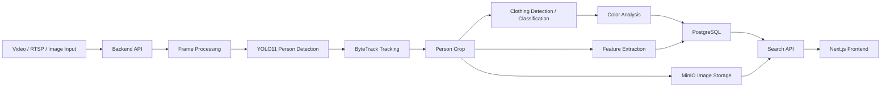

# บทที่ 3 วิธีการดำเนินงานและการออกแบบระบบ

> ไฟล์นี้เป็น template สำหรับเขียนบทที่ 3 ของระบบค้นหาและติดตามบุคคลจากภาพ CCTV ด้วยการตรวจจับบุคคล เสื้อผ้า สี และ feature vector  
> หลักการของบทนี้คือ "อธิบายว่าระบบถูกออกแบบและพัฒนาอย่างไร" ส่วนตัวเลขผลการทดสอบจริง เช่น accuracy, FPS, mAP, precision, recall ควรนำไปใส่บทที่ 4

## 3.1 บทนำ

ส่วนนี้ใช้เกริ่นว่าบทที่ 3 จะอธิบายขั้นตอนการออกแบบและพัฒนาระบบ ตั้งแต่การรับข้อมูลวิดีโอจากกล้องหรือไฟล์วิดีโอ การประมวลผลด้วยโมเดล AI การติดตามบุคคล การวิเคราะห์เสื้อผ้าและสี การจัดเก็บข้อมูล ไปจนถึงส่วนติดต่อผู้ใช้สำหรับค้นหาบุคคล

ตัวอย่างเนื้อหา:

โครงงานนี้พัฒนาระบบช่วยค้นหาบุคคลจากฟุตเทจกล้องวงจรปิด โดยมีเป้าหมายเพื่อลดระยะเวลาการค้นหาด้วยมนุษย์และลดโอกาสผิดพลาดจากการตรวจสอบวิดีโอจำนวนมาก ระบบถูกออกแบบให้ใช้คอมพิวเตอร์หนึ่งเครื่องร่วมกับผู้ใช้งานหนึ่งคนในการค้นหาบุคคลตามคุณลักษณะ เช่น ประเภทเสื้อผ้า สีเสื้อผ้า ค่าความมั่นใจของโมเดล และรูปภาพตัวอย่างที่ผู้ใช้อัปโหลด ระบบประกอบด้วยการตรวจจับบุคคล การติดตาม track id การตรวจจับเสื้อผ้า การวิเคราะห์สี การจัดเก็บผลลัพธ์ และการค้นหาผ่านเว็บแอปพลิเคชัน

ควรระบุขอบเขตตั้งแต่ต้น:

| ประเด็น | อยู่ในขอบเขต | อยู่นอกขอบเขต |
|---|---|---|
| ค้นหาบุคคลจากวิดีโอ/รูปภาพ | ใช่ | - |
| ตรวจจับบุคคล เสื้อผ้า และสี | ใช่ | - |
| ช่วยแก้ปัญหา track id หลุดในกล้องเดียว | ใช่ ระดับหนึ่ง | - |
| ติดตามข้ามกล้องอัตโนมัติ | ยังไม่ใช่ระบบหลัก | เป็นแนวทางพัฒนาต่อ |
| แก้ปัญหาเงาหนัก ภาพแตก มุมกล้องแย่มาก | รองรับบางกรณีเล็กน้อย | ไม่รับประกันในกรณีรุนแรง |

## 3.2 ภาพรวมสถาปัตยกรรมระบบ

ส่วนนี้ควรมี **รูปที่ 3.1 System Architecture Diagram**

สิ่งที่ควรวาดในรูป:

- Input Layer: ไฟล์วิดีโอ, RTSP stream, YouTube/stream input, รูปภาพสำหรับค้นหา
- AI Processing Layer: YOLO11 person detection, ByteTrack, clothing detection/classification, color analysis, feature extraction
- Backend/API Layer: FastAPI, search API, realtime API, video queue, camera management
- Storage Layer: PostgreSQL, MinIO
- Frontend Layer: Next.js UI, dashboard, search, realtime, investigation, camera management

Mermaid draft สำหรับเอาไปวาดต่อใน draw.io หรือ diagrams.net:



คำอธิบายใต้รูป:

ระบบเริ่มจากรับข้อมูลภาพหรือวิดีโอเข้าสู่ backend จากนั้นแยก frame เพื่อประมวลผลด้วยโมเดลตรวจจับบุคคล เมื่อพบบุคคลแล้วระบบใช้ ByteTrack เพื่อกำหนด track id และตัดบริเวณบุคคลออกมาใช้ในขั้นตอนถัดไป ได้แก่ การตรวจจับหรือจำแนกประเภทเสื้อผ้า การวิเคราะห์สี และการดึง feature vector ข้อมูลที่ได้ถูกบันทึกลง PostgreSQL ส่วนภาพ crop ของบุคคลบันทึกใน MinIO เพื่อให้ frontend สามารถแสดงผลและค้นหาย้อนหลังได้

## 3.3 การออกแบบกระบวนการประมวลผลภาพ

ส่วนนี้เป็นหัวใจของบท 3 ควรมี **รูปที่ 3.2 Two-Pass Detection Pipeline**

แนวคิดหลัก: ระบบใช้การ predict 2 รอบ

1. รอบที่ 1 ตรวจจับบุคคลจาก frame เต็ม
2. รอบที่ 2 นำ bounding box ของบุคคลไปตรวจจับ/จำแนกเสื้อผ้าและวิเคราะห์สี

ตารางที่ควรใส่:

| ขั้นตอน | ข้อมูลเข้า | กระบวนการ | ข้อมูลออก |
|---|---|---|---|
| Person Detection | frame จากวิดีโอ | YOLO11 ตรวจจับ class person | bbox, confidence |
| Tracking | bbox ของบุคคล | ByteTrack | track_id |
| Person Crop | frame + bbox | crop ภาพเฉพาะบุคคล | person image |
| Clothing Detection | person image | ตรวจจับ/จำแนกเสื้อผ้า | class เสื้อผ้า, confidence |
| Color Analysis | crop เสื้อผ้า/person crop | วิเคราะห์สีด้วย HSV และ color groups | primary color, detailed colors, color groups |
| Feature Extraction | person crop | ดึง embedding/vector | feature vector |
| Storage | detection result | บันทึก DB และ MinIO | searchable record |

ตัวอย่าง pseudocode ที่ควรใส่เป็น **โค้ดที่ 3.1 ขั้นตอนการประมวลผลแบบ 2 รอบ**

```python
def process_frame(frame):
    person_boxes = person_detector.track_people(frame)

    for person_box in person_boxes:
        track_id = person_box.track_id
        person_crop = crop(frame, person_box.bbox)

        clothing_items = clothing_model.predict(person_crop)
        colors = analyze_colors(person_crop, clothing_items)
        embedding = feature_extractor.get_embedding(person_crop)

        save_detection(
            track_id=track_id,
            person_bbox=person_box.bbox,
            clothing_items=clothing_items,
            colors=colors,
            embedding=embedding,
        )
```

หมายเหตุสำหรับการเขียน:

- อย่าเขียนว่าโมเดลแก้ปัญหาแสง เงา หรือมุมกล้องได้ทั้งหมด
- ให้เขียนว่าใช้ระบบสีที่พิจารณา HSV, brightness, tone group และ color grouping เพื่อช่วยให้การค้นหายืดหยุ่นขึ้นในกรณีแสงเปลี่ยนเล็กน้อย
- ถ้ามีกรณีที่ภาพมืดมาก เงาหนัก ภาพแตก หรือมุมกล้องผิดปกติ ให้ระบุเป็นข้อจำกัดของระบบ

## 3.4 การเลือกโมเดลและเทคโนโลยี AI

ส่วนนี้ควรอธิบายเหตุผลในการเลือก YOLO11, ByteTrack, feature extraction และระบบสี

### 3.4.1 เหตุผลในการเลือก Object Detection และ YOLO11

ควรเขียนประเด็นเหล่านี้:

- เลือก Object Detection เพราะระบบต้องการ bounding box เพื่อนำไปประมวลผลต่อ เช่น bbox คนสำหรับ crop บุคคล และ bbox/ผลเสื้อผ้าสำหรับวิเคราะห์สี
- YOLO เหมาะกับงานวิดีโอเพราะมีความเร็วสูงและใช้งานแบบ real-time/near real-time ได้ดีกว่าแนวทางที่ซับซ้อนกว่าในงานทั่วไป
- YOLO11 ถูกเลือกเพราะจากการทดลองกับโมเดลขนาดใกล้เคียงกันให้ผลดีกว่า YOLOv8 ในระบบนี้
- Ultralytics YOLO รองรับการใช้งานร่วมกับ tracking เช่น ByteTrack ได้สะดวก ทำให้ลดเวลาพัฒนา
- ใช้ `imgsz=320` ในระบบจริงเพื่อช่วยลดภาระ GPU GTX 1650 4GB

ตารางที่ควรใส่:

| โมเดล/วิธี | จุดเด่น | ข้อจำกัด | เหตุผลที่เลือก/ไม่เลือก |
|---|---|---|---|
| YOLO11 | เร็ว, ได้ bbox, ใช้กับวิดีโอได้ดี | ยังขึ้นกับคุณภาพภาพและแสง | เลือก เพราะแม่นกว่า YOLOv8 ในขนาดใกล้เคียงกันจากการทดลอง |
| YOLOv8 | เสถียร, เอกสารเยอะ | ผลทดลองในโปรเจคด้อยกว่า YOLO11 | ใช้เป็น baseline เปรียบเทียบ |
| Faster R-CNN | แม่นในหลายงาน | ช้ากว่าและหนักกว่า | ไม่เลือก เพราะฮาร์ดแวร์จำกัดและต้องการวิดีโอ |

### 3.4.2 เหตุผลในการเลือก ByteTrack

ควรเขียน:

- ByteTrack ใช้ข้อมูล detection ที่มี confidence สูงและต่ำมาช่วยคง track ต่อเนื่อง
- มีความเร็วสูงและไม่ต้องพึ่ง appearance embedding หนักเท่า DeepSORT
- เหมาะกับ GPU และ RAM จำกัด
- ข้อจำกัดคือเมื่อคนซ้อนทับกัน หายไปจากเฟรม หรือ ByteTrack จ่าย id ใหม่ ระบบยังต้องใช้ feature vector และสีมาช่วย map กลับเป็น id เดิม

ตารางที่ควรใส่:

| Tracker | จุดเด่น | ข้อจำกัด | ผลต่อการตัดสินใจ |
|---|---|---|---|
| ByteTrack | เร็ว, เบา, เหมาะกับวิดีโอ | id อาจหลุดเมื่อ occlusion หรือ detection หาย | เลือกใช้เป็น tracker หลัก |
| DeepSORT | มี appearance feature ช่วย Re-ID | หนักกว่าและช้ากว่า | ไม่เลือกเป็นตัวหลักเพราะ performance |

## 3.5 การออกแบบระบบ Tracking และ Re-identification

ส่วนนี้ควรมี **รูปที่ 3.3 Tracking and ID Recovery Flow**

สิ่งที่ต้องอธิบาย:

- ระบบใช้ ByteTrack เป็นตัวให้ track id เบื้องต้น
- ถ้า ByteTrack ให้ id เดิม และตำแหน่งไม่กระโดดผิดปกติ ระบบถือว่าเป็นบุคคลเดิม
- ถ้า id หลุดหรือมี id ใหม่เกิดใกล้ตำแหน่งที่ track เดิมหายไป ระบบใช้ feature vector และสีช่วยเปรียบเทียบ
- ถ้าความคล้ายมากพอ จะ map กลับเป็น persistent id เดิม
- ขอบเขตปัจจุบันยังเน้นในกล้องเดียว ไม่ใช่ cross-camera Re-ID เต็มรูปแบบ

ตัวอย่าง pseudocode สำหรับ **โค้ดที่ 3.2 การกู้คืน track id**

```python
def recover_track(new_detection, lost_tracks):
    best_id = None
    best_score = 0.0

    for old_id, old_features in lost_tracks.items():
        feature_score = cosine_similarity(
            new_detection.embedding,
            old_features.embedding,
        )
        color_score = color_group_similarity(
            new_detection.color_groups,
            old_features.color_groups,
        )
        score = (feature_score + color_score) / 2

        if score > best_score:
            best_score = score
            best_id = old_id

    if best_score >= RECOVERY_THRESHOLD:
        return best_id

    return create_new_id()
```

ตารางที่ควรใส่:

| เงื่อนไข | วิธีตัดสินใจ | ผลลัพธ์ |
|---|---|---|
| ByteTrack id เดิม และตำแหน่งใกล้เดิม | เชื่อมต่อ track ต่อ | ใช้ id เดิม |
| ByteTrack id ใหม่ แต่ใกล้ track ที่เพิ่งหาย | เปรียบเทียบ feature vector + สี | อาจ map เป็น id เดิม |
| Feature/สีไม่คล้าย | ถือว่าเป็นคนใหม่ | สร้าง id ใหม่ |
| ภาพไม่ชัดหรือ crop ผิด | similarity ไม่น่าเชื่อถือ | เก็บเป็นข้อจำกัด |

ความคิดเห็นที่ควรใส่:

ระบบ Re-ID ในโครงงานนี้ยังเป็นการช่วยแก้ปัญหา track id หลุดในระดับเบื้องต้น โดยใช้ feature vector และข้อมูลสีร่วมกัน ยังไม่ได้ออกแบบให้เป็นระบบติดตามข้ามกล้องเต็มรูปแบบ เนื่องจากการติดตามข้ามกล้องต้องพิจารณาเวลา ตำแหน่งกล้อง ทิศทางการเดิน และความสัมพันธ์ระหว่างกล้องเพิ่มเติม

## 3.6 การออกแบบการตรวจจับเสื้อผ้าและ Attribute

ระบุ class ที่ระบบใช้ให้ชัดเจน:

| กลุ่ม | Class | ความหมาย |
|---|---|---|
| ส่วนบน | `long_sleeve_top` | เสื้อแขนยาว |
| ส่วนบน | `short_sleeve_top` | เสื้อแขนสั้น |
| เต็มตัว | `dress` | เดรส |
| ส่วนล่าง | `skirt` | กระโปรง |
| ส่วนล่าง | `shorts` | กางเกงขาสั้น |
| ส่วนล่าง | `trousers` | กางเกงขายาว |

ควรมี **รูปที่ 3.4 ตัวอย่างผลการตรวจจับเสื้อผ้า**

รูปที่ควรใส่:

- ภาพ frame ต้นฉบับ
- ภาพ bbox คน
- ภาพ crop คน
- ภาพผลเสื้อผ้าและสี เช่น top: short_sleeve_top, color: blue_tones

คำอธิบาย:

หลังจากตรวจจับบุคคลแล้ว ระบบนำภาพ crop ของบุคคลเข้าสู่โมเดลตรวจจับ/จำแนกเสื้อผ้า เพื่อระบุประเภทเสื้อผ้าที่บุคคลสวมใส่ โดยออกแบบให้เลือกผลลัพธ์หลักไม่เกินส่วนบนหนึ่งรายการและส่วนล่างหนึ่งรายการ เพื่อลดความซ้ำซ้อนของผลลัพธ์และทำให้การค้นหามีโครงสร้างชัดเจน

## 3.7 การออกแบบระบบวิเคราะห์สี

ส่วนนี้สำคัญมาก เพราะเป็นจุดที่ระบบของคุณพยายาม handle แสงเล็กน้อย

ควรมี **รูปที่ 3.5 Color Analysis Flow**

ขั้นตอนที่ควรอธิบาย:

1. crop ภาพเสื้อผ้าหรือภาพบุคคล
2. ลดขนาดภาพเพื่อความเร็ว
3. แยก foreground เท่าที่ทำได้
4. แปลง BGR/RGB เป็น HSV
5. ตรวจช่วงสีตามค่า H, S, V
6. ใช้ competitive grouping เพื่อลดปัญหาสีซ้อนกัน
7. สรุปเป็น detailed colors และ color groups

ตารางที่ควรใส่:

| ประเภทข้อมูลสี | ตัวอย่าง | ใช้เพื่อ |
|---|---|---|
| Detailed color | `navy`, `light_blue`, `dark_gray` | เปรียบเทียบแบบละเอียด |
| Tone group | `blue_tones`, `black_tones` | ค้นหาแบบยืดหยุ่น |
| Brightness group | `light_colors`, `dark_colors` | รองรับแสงสว่างต่างกัน |
| Temperature group | `warm_colors`, `cool_colors` | ช่วยจัดกลุ่มสีเชิงภาพ |
| Clothing group | `formal_colors`, `common_pants_colors` | ช่วยค้นหาในบริบทเสื้อผ้า |

ตัวอย่าง **โค้ดที่ 3.3 การวิเคราะห์สีแบบย่อ**

```python
def analyze_clothing_color(crop):
    small = resize(crop, size=(64, 64))
    hsv = convert_bgr_to_hsv(small)
    detailed_colors = match_hsv_ranges(hsv)
    color_groups = group_detailed_colors(detailed_colors)
    primary_color = get_primary_color(detailed_colors)

    return {
        "primary_color": primary_color,
        "detailed_colors": detailed_colors,
        "color_groups": color_groups,
    }
```

ข้อควรเขียนเป็นข้อจำกัด:

- เงาเข้มมากอาจทำให้สีถูกตีความเป็นสีดำหรือสีเข้ม
- กล้องความละเอียดต่ำทำให้ pixel ของเสื้อผ้าไม่พอสำหรับวิเคราะห์สี
- มุมกล้องที่เห็นเสื้อผ้าไม่เต็มตัวทำให้ผลลัพธ์คลาดเคลื่อน
- ระบบช่วยลดปัญหาแสงเล็กน้อยได้ แต่ไม่สามารถแก้ปัญหาภาพคุณภาพต่ำรุนแรงได้ทั้งหมด

## 3.8 การออกแบบฐานข้อมูลและการจัดเก็บไฟล์

ส่วนนี้ควรมี **รูปที่ 3.6 Data Storage Design** และ **ตารางโครงสร้างฐานข้อมูล**

### 3.8.1 PostgreSQL

ตารางหลักที่ควรอธิบายตามระบบ:

| ตาราง | หน้าที่ | ตัวอย่างข้อมูล |
|---|---|---|
| `cameras` | เก็บข้อมูลกล้อง | camera id, name, source url |
| `processed_videos` | เก็บสถานะวิดีโอที่ประมวลผล | video id, filename, status, progress |
| `detections` | เก็บผลตรวจจับระดับบุคคล | track_id, timestamp, bbox, image_path, camera_id, embedding |
| `detection_items` | เก็บรายการเสื้อผ้าที่ตรวจพบ | class_name, category, confidence, bbox |
| `detection_colors` | เก็บข้อมูลสีของเสื้อผ้า | top_colors, brightness, vibrancy, temperature, primary_color |

ตัวอย่าง **ตารางที่ 3.x โครงสร้างตาราง detections**

| Field | Type | Description |
|---|---|---|
| `id` | UUID | รหัสรายการตรวจจับ |
| `track_id` | INT | รหัสติดตามจากระบบ tracking |
| `timestamp` | TIMESTAMP | เวลาที่พบ |
| `camera_id` | VARCHAR | รหัสกล้อง |
| `bbox` | JSONB | ตำแหน่ง bounding box |
| `image_path` | TEXT | path ของภาพใน MinIO |
| `embedding` | JSONB หรือ vector | feature vector สำหรับเปรียบเทียบ |

### 3.8.2 คำแนะนำเรื่องการเก็บ feature vector

ข้อเสนอแนะ:

- ถ้าข้อมูลยังไม่มาก สามารถเก็บ embedding เป็น `JSONB` ได้ แต่การค้นหา similarity จะต้องดึงข้อมูลมาคำนวณใน Python ซึ่งจะช้าลงเมื่อข้อมูลมากขึ้น
- ถ้าต้องการค้นหา vector จริงจัง ควรใช้ PostgreSQL extension `pgvector` และแยกตาราง `embeddings`
- ควรบันทึก vector เฉพาะ key frame หรือช่วงที่ track เปลี่ยน ไม่ควรบันทึกทุก frame
- ควรสร้าง index แบบ HNSW หรือ IVFFlat เมื่อข้อมูลเริ่มมาก

ตัวอย่าง schema ที่แนะนำ:

```sql
CREATE EXTENSION IF NOT EXISTS vector;

CREATE TABLE embeddings (
    id UUID PRIMARY KEY DEFAULT gen_random_uuid(),
    detection_id UUID REFERENCES detections(id) ON DELETE CASCADE,
    embedding vector(512),
    created_at TIMESTAMP DEFAULT CURRENT_TIMESTAMP
);

CREATE INDEX idx_embeddings_cosine
ON embeddings
USING hnsw (embedding vector_cosine_ops);
```

ให้เขียนในเล่มแบบระวัง:

หากระบบปัจจุบันยังใช้ `JSONB` เป็นหลัก ให้เขียนว่า "ระบบรองรับการบันทึก feature vector ในฐานข้อมูล และมีแนวทางปรับปรุงเป็น pgvector เพื่อเพิ่มประสิทธิภาพการค้นหา similarity เมื่อข้อมูลมีขนาดใหญ่ขึ้น" อย่าเขียนเหมือน pgvector เป็น production แล้วถ้ายังไม่ได้ใช้จริงเต็มระบบ

### 3.8.3 MinIO

ควรอธิบาย:

- ใช้ MinIO เก็บภาพ crop ของบุคคล เพราะไฟล์ภาพไม่เหมาะกับการเก็บตรงในฐานข้อมูล
- PostgreSQL เก็บ metadata และ path ของภาพ
- ลดการใช้พื้นที่ด้วยการบันทึกทุก ๆ X frame และบันทึกเมื่อ track id เปลี่ยนหรือมีเหตุการณ์สำคัญ

ตารางที่ควรใส่:

| เงื่อนไขการบันทึกภาพ | เหตุผล |
|---|---|
| ทุก ๆ X frame | ลดจำนวนไฟล์และลด IO |
| เมื่อ track id เปลี่ยน | เก็บหลักฐานช่วงที่อาจเกิดการเปลี่ยนคน |
| เมื่อพบ attribute สำคัญ | ใช้แสดงผลและค้นหาย้อนหลัง |

## 3.9 การออกแบบ Backend และ API

ควรมี **รูปที่ 3.7 Backend Module Diagram**

ตาราง mapping ไฟล์ในโปรเจคกับหน้าที่:

| Module/File | หน้าที่ |
|---|---|
| `src/ai/detector.py` | โหลด YOLO และตรวจจับ/track บุคคลด้วย ByteTrack |
| `src/services/frame_processor.py` | ประมวลผล frame รวม person detection, clothing, color, embedding |
| `src/services/hybrid_tracker.py` | map ByteTrack id เป็น persistent id และกู้คืน track |
| `src/ai/color_system.py` | วิเคราะห์ detailed colors และ color groups |
| `src/services/database.py` | จัดการ PostgreSQL และ query |
| `src/services/storage.py` | จัดการไฟล์ภาพใน MinIO |
| `src/services/image_analyzer.py` | วิเคราะห์รูปภาพที่ผู้ใช้อัปโหลดเพื่อช่วยค้นหา |
| `src/api/routes/search.py` | API การค้นหา |
| `src/api/routes/realtime.py` | API การประมวลผล realtime |

ควรใส่ **โค้ดที่ 3.4 ตัวอย่าง API ค้นหา** แบบย่อ ไม่ต้องใส่ทั้งไฟล์:

```python
@router.post("/search")
def search_detections(criteria: SearchCriteria):
    results = database.search(
        clothing_type=criteria.clothing_type,
        colors=criteria.colors,
        min_confidence=criteria.min_confidence,
        time_range=criteria.time_range,
    )
    return {"results": results}
```

คำอธิบาย:

Backend ทำหน้าที่เป็นตัวกลางระหว่าง frontend, AI pipeline และฐานข้อมูล โดยแยกการทำงานเป็น route สำหรับค้นหา route สำหรับ realtime route สำหรับจัดการกล้อง และ service สำหรับประมวลผลภาพ ทำให้ระบบสามารถดูแลและทดสอบแต่ละส่วนได้ง่ายขึ้น

## 3.10 การออกแบบส่วนติดต่อผู้ใช้

ควรมีรูปหน้าจอจริงอย่างน้อย 4 รูป:

| รูป | หน้าจอ | สิ่งที่ต้องชี้ให้เห็น |
|---|---|---|
| รูปที่ 3.8 | Dashboard | ภาพรวมวิดีโอ/สถิติ/รายการเหตุการณ์ |
| รูปที่ 3.9 | Search/Investigation | filter สี เสื้อผ้า confidence และผลลัพธ์ |
| รูปที่ 3.10 | Realtime | การแสดงกล้อง/stream แบบ real-time |
| รูปที่ 3.11 | Camera Management | การจัดการกล้องและความสัมพันธ์ของกล้อง |

สิ่งที่ควรอธิบายใน Search UI:

- เลือกประเภทเสื้อผ้า
- เลือกสีหรือกลุ่มสี
- ปรับค่าความมั่นใจขั้นต่ำ
- อัปโหลดรูปภาพเพื่อให้ระบบวิเคราะห์ attribute แล้วเติมเงื่อนไขค้นหา
- แสดงผลเป็นรูป crop พร้อม track id, เวลา, กล้อง, attribute

ตัวอย่าง **โค้ดที่ 3.5 โครงสร้าง search criteria**

```typescript
type SearchCriteria = {
  clothingType?: string;
  colors?: string[];
  minConfidence?: number;
  imageInput?: File;
  cameraId?: string;
  timeRange?: {
    start: string;
    end: string;
  };
};
```

## 3.11 การเตรียม Dataset และการ Train โมเดล

ส่วนนี้ควรมี **ตารางที่ 3.x รายละเอียดชุดข้อมูล**

| Dataset | จำนวนโดยประมาณ | ลักษณะข้อมูล | การใช้งาน |
|---|---:|---|---|
| PA-100K | ประมาณ 4,000 รูปที่ label เอง | ภาพบุคคลและ attribute | ใช้ช่วยฝึก/ปรับปรุงการจำแนกเสื้อผ้า |
| DeepFashion2 | ประมาณ 4,000 รูป | มี label เสื้อผ้าอยู่แล้ว | ใช้ฝึก/ตรวจสอบ class เสื้อผ้า |

ควรอธิบายขั้นตอน:

1. คัดเลือกภาพที่เกี่ยวข้องกับบุคคลและเสื้อผ้า
2. กำหนด class ให้ตรงกับระบบ 6 class
3. ตรวจสอบ label ที่ผิดหรือซ้ำ
4. แบ่งข้อมูล train/validation/test
5. train โมเดลและเลือก checkpoint ที่ให้ผลดีที่สุด
6. นำโมเดลมาใช้ใน pipeline จริง

ตาราง hyperparameter ที่ควรใส่:

| รายการ | ค่า | หมายเหตุ |
|---|---|---|
| model | YOLO11 | ระบุขนาด model เช่น n/s ถ้าแน่ใจ |
| image size | [TODO] | เช่น 320 หรือ 640 ตามตอน train |
| epochs | [TODO] | ใส่ค่าจริง |
| batch size | [TODO] | ใส่ตาม GPU 4GB |
| optimizer | [TODO] | ใส่ค่าจริง |
| confidence threshold | [TODO] | ใส่ค่าที่ใช้ในระบบ |

คำเตือน:

อย่าใส่ค่าที่จำไม่ได้ ให้ใส่ `[TODO: ตรวจจาก training log]` ไว้ก่อน ดีกว่าใส่ตัวเลขผิด

## 3.12 การออกแบบการทำงานภายใต้ข้อจำกัดฮาร์ดแวร์

ระบุ hardware จริง:

| รายการ | สเปก |
|---|---|
| GPU | NVIDIA GTX 1650 4GB |
| RAM | 16GB |
| CPU | [TODO] |
| Storage | [TODO] |
| OS | [TODO] |

สิ่งที่ควรอธิบาย:

- ใช้โมเดลขนาดเล็กหรือ input size ต่ำลงเพื่อลด VRAM
- ใช้ queue/thread pool เพื่อไม่ให้ UI หรือ API ค้าง
- ลดจำนวนภาพที่บันทึกลง MinIO ด้วยการบันทึกทุก X frame
- จำกัด batch size และจำนวน stream ตามความสามารถเครื่อง
- แยกงานที่จำเป็นต้อง real-time กับงานที่ประมวลผลย้อนหลัง

ตารางปัญหาและวิธีแก้:

| ปัญหา | สาเหตุ | วิธีจัดการในระบบ | ข้อจำกัดที่เหลือ |
|---|---|---|---|
| GPU memory เต็ม | VRAM 4GB | ลด image size, ใช้โมเดลเล็ก, ประมวลผลเป็นคิว | รองรับหลายกล้องพร้อมกันได้น้อย |
| FPS ต่ำ | inference หนัก | frame skipping/queue/thread pool | อาจพลาดบางช่วง |
| DB/Storage โตเร็ว | บันทึกทุก frame | บันทึกทุก X frame และเหตุการณ์สำคัญ | ต้องกำหนด retention เพิ่ม |
| สีเพี้ยนจากแสง | แสงและเงา | ใช้ HSV และ color groups | เงารุนแรงยังแก้ไม่ได้ |

## 3.13 การออกแบบด้านความปลอดภัยและ PDPA

ส่วนนี้ไม่ต้องฟันธงกฎหมายเกินไป ให้เขียนเป็นมาตรการออกแบบระบบ

ประเด็นที่ควรใส่:

- ภาพบุคคลถือเป็นข้อมูลส่วนบุคคล จึงต้องจำกัดการเข้าถึง
- เก็บข้อมูลเท่าที่จำเป็น เช่น bbox, attribute, track id, image path
- ใช้ role-based access control สำหรับผู้ดูแลระบบ ผู้ปฏิบัติงาน และผู้ชมข้อมูล
- มี audit log สำหรับการค้นหาและการเปิดดูภาพ
- กำหนดระยะเวลาการเก็บข้อมูลและการลบข้อมูล
- ถ้าใช้ภาพจากอินเทอร์เน็ตในการ train/test ควรระบุแหล่งที่มา เงื่อนไขการใช้งาน และหลีกเลี่ยงการเผยแพร่ภาพที่ระบุตัวบุคคลได้ในรายงาน

ตารางมาตรการ:

| ความเสี่ยง | มาตรการในระบบ | หมายเหตุ |
|---|---|---|
| ผู้ไม่เกี่ยวข้องเข้าถึงภาพ | Login และ role | ควรเพิ่มในระบบจริง |
| ค้นหาบุคคลผิดวัตถุประสงค์ | Audit log | บันทึกว่าใครค้นหาอะไรเมื่อไร |
| เก็บข้อมูลนานเกินจำเป็น | Retention policy | เช่น ลบหลัง X วัน |
| เผยแพร่ภาพในรายงาน | blur หน้า/ใช้ภาพตัวอย่างที่ไม่ระบุตัวตน | ลดความเสี่ยง PDPA |

## 3.14 แผนการทดสอบระบบ

บท 3 ควรเขียนแผนการทดสอบ ส่วนผลลัพธ์จริงค่อยไปบท 4

ตารางแผนการทดสอบ:

| การทดสอบ | วัตถุประสงค์ | วิธีทดสอบ | Metric |
|---|---|---|---|
| Person detection | ตรวจว่าพบบุคคลถูกต้อง | ใช้ภาพ/วิดีโอทดสอบที่มีคน | precision, recall |
| Clothing classification | ตรวจ class เสื้อผ้า | เทียบกับ label | accuracy, F1-score |
| Color analysis | ตรวจสีหลัก | เทียบกับ label สีที่กำหนดเอง | color accuracy |
| Tracking | ตรวจ track id ต่อเนื่อง | วิดีโอที่คนเดินผ่านกล้อง | ID switch, tracking continuity |
| Search | ตรวจผลค้นหา | ค้นด้วยสี/เสื้อผ้า/รูปภาพ | top-k precision |
| Performance | ตรวจความเร็ว | ทดสอบบน GTX 1650 | FPS, latency, RAM/VRAM |

ควรมีรูป/กราฟในบท 4:

- กราฟ FPS ตามจำนวน stream
- ตาราง accuracy ของ class เสื้อผ้า
- confusion matrix ของ class เสื้อผ้า
- ตัวอย่างค้นหาถูก/ผิด
- ตัวอย่างกรณีแสงเงาที่ระบบทำได้และทำไม่ได้

## 3.15 สรุปปัญหาที่พบระหว่างพัฒนาและแนวทางแก้

ส่วนนี้ควรเขียนแบบตรงไปตรงมา เพราะทำให้เล่มดูน่าเชื่อถือ

ตารางที่ควรใส่:

| ปัญหา | ผลกระทบ | วิธีที่ใช้ resolve | สถานะ |
|---|---|---|---|
| การค้นหาจากฟุตเทจจำนวนมากใช้เวลานาน | คนเดียวตรวจวิดีโอไม่ไหว | สร้างระบบค้นหาด้วย attribute และรูปภาพ | แก้ได้ตามเป้าหมายหลัก |
| ByteTrack id หลุด | คนเดิมอาจได้ id ใหม่ | ใช้ feature vector และสีช่วย map กลับ | แก้ได้บางกรณี |
| แสงและเงาทำให้สีผิด | ค้นหาสีคลาดเคลื่อน | ใช้ HSV, detailed colors, color groups | แก้ได้เฉพาะกรณีไม่รุนแรง |
| GPU GTX 1650 จำกัด | FPS ต่ำและรองรับกล้องน้อย | ลด image size, ใช้โมเดลเล็ก, queue | ยังเป็นข้อจำกัด |
| ข้อมูลภาพมีจำนวนมาก | storage โตเร็ว | ใช้ MinIO และบันทึกเฉพาะบาง frame | ต้องมี retention ต่อ |
| ยังไม่มี cross-camera tracking | ค้นหาข้ามกล้องยังไม่อัตโนมัติ | วางโครง camera relationship ไว้ | งานอนาคต |

## 3.16 สรุปบท

ตัวอย่างเนื้อหา:

บทนี้ได้อธิบายการออกแบบและพัฒนาระบบช่วยค้นหาบุคคลจากภาพกล้องวงจรปิด โดยระบบใช้กระบวนการตรวจจับ 2 รอบ เริ่มจากการตรวจจับบุคคลด้วย YOLO11 และติดตามด้วย ByteTrack จากนั้นนำภาพบุคคลไปตรวจจับประเภทเสื้อผ้า วิเคราะห์สี และดึง feature vector เพื่อใช้ประกอบการค้นหาและช่วยลดปัญหา track id หลุด ข้อมูลผลลัพธ์ถูกจัดเก็บใน PostgreSQL และภาพ crop ถูกจัดเก็บใน MinIO พร้อมพัฒนา frontend ด้วย Next.js เพื่อให้ผู้ใช้สามารถค้นหาด้วยประเภทเสื้อผ้า สี ค่าความมั่นใจ และรูปภาพตัวอย่างได้ นอกจากนี้บทนี้ยังระบุข้อจำกัดจากฮาร์ดแวร์และสภาพแวดล้อมของภาพ เช่น แสง เงา ความละเอียด และมุมกล้อง ซึ่งเป็นประเด็นที่ต้องนำไปประเมินในบทที่ 4

---

# Checklist สำหรับรูป ตาราง โค้ด และ diagram ที่ควรมีในบท 3

## รูป/Diagram

| ลำดับ | รายการ | ตำแหน่ง |
|---|---|---|
| รูปที่ 3.1 | System Architecture Diagram | 3.2 |
| รูปที่ 3.2 | Two-Pass Detection Pipeline | 3.3 |
| รูปที่ 3.3 | Tracking and ID Recovery Flow | 3.5 |
| รูปที่ 3.4 | ตัวอย่าง bbox คนและเสื้อผ้า | 3.6 |
| รูปที่ 3.5 | Color Analysis Flow | 3.7 |
| รูปที่ 3.6 | Database/Storage Design | 3.8 |
| รูปที่ 3.7 | Backend Module Diagram | 3.9 |
| รูปที่ 3.8-3.11 | Screenshot UI | 3.10 |

## ตาราง

| ลำดับ | รายการ | ตำแหน่ง |
|---|---|---|
| ตารางขอบเขตระบบ | 3.1 |
| ตาราง data flow | 3.3 |
| ตารางเปรียบเทียบ YOLO11/YOLOv8/Faster R-CNN | 3.4 |
| ตารางเปรียบเทียบ ByteTrack/DeepSORT | 3.4 |
| ตารางเงื่อนไขการกู้คืน track id | 3.5 |
| ตาราง class เสื้อผ้า 6 class | 3.6 |
| ตารางประเภทข้อมูลสี | 3.7 |
| ตาราง schema ฐานข้อมูล | 3.8 |
| ตาราง dataset และ hyperparameter | 3.11 |
| ตาราง hardware limitation | 3.12 |
| ตาราง PDPA/security measure | 3.13 |
| ตารางแผนการทดสอบ | 3.14 |
| ตารางปัญหาและวิธี resolve | 3.15 |

## โค้ด

| ลำดับ | รายการ | ตำแหน่ง |
|---|---|---|
| โค้ดที่ 3.1 | Two-pass detection pseudocode | 3.3 |
| โค้ดที่ 3.2 | Track recovery pseudocode | 3.5 |
| โค้ดที่ 3.3 | Color analysis pseudocode | 3.7 |
| โค้ดที่ 3.4 | Search API pseudocode | 3.9 |
| โค้ดที่ 3.5 | Search criteria type | 3.10 |
| โค้ด SQL | pgvector/embedding schema | 3.8 |

## สิ่งที่ต้องตรวจจากโปรเจคจริงก่อนใส่เล่ม

- ค่า confidence threshold ที่ใช้จริง
- ค่า X frame สำหรับการบันทึกภาพ
- ขนาดโมเดล YOLO11 ที่ใช้จริง เช่น nano/small
- image size ตอน train และตอน inference
- จำนวน epoch, batch size, optimizer
- จำนวนข้อมูล train/validation/test ที่แน่นอน
- dimension ของ feature vector
- สถานะจริงของ pgvector ว่าใช้จริงหรือเป็นแผนพัฒนาต่อ
- ภาพ screenshot UI ล่าสุด
- ผลการทดสอบจริงสำหรับบท 4
