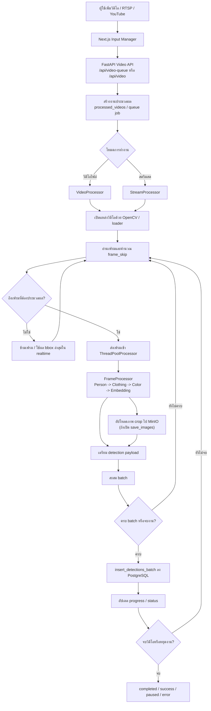

# ภาพที่ 3.10 แผนภาพลำดับการประมวลผลวิดีโอและ Queue

## คำอธิบายสำหรับใส่ในรายงาน

แผนภาพนี้อธิบาย flow การประมวลผลวิดีโอของระบบจริง โดยระบบไม่ได้ประมวลผลทุกเฟรมเสมอไป แต่ใช้ `frame_skip` เพื่อลดภาระ GPU และ CPU เฟรมที่ถูกเลือกจะถูกส่งเข้า `ThreadPoolProcessor` เพื่อให้ `FrameProcessor` ทำงาน AI หลัก จากนั้นระบบจะอัปโหลดภาพไปยัง MinIO และสะสมข้อมูลเป็น batch ก่อนบันทึกลง PostgreSQL วิธีนี้ช่วยลดภาระการเขียนฐานข้อมูลและเหมาะกับข้อจำกัดของเครื่องที่มี GPU VRAM 4GB

