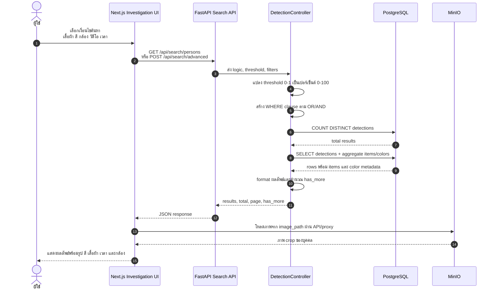

# ภาพที่ 3.11 Sequence Diagram การค้นหาบุคคลจากเงื่อนไขเสื้อผ้าและสี

## คำอธิบายสำหรับใส่ในรายงาน

แผนภาพนี้แสดงการทำงานของฟังก์ชันค้นหาย้อนหลัง ผู้ใช้กำหนดเงื่อนไขในหน้า Investigation จากนั้น frontend ส่งเงื่อนไขไปยัง FastAPI ระบบจะสร้าง SQL query โดย join ตาราง `detections`, `detection_items` และ `detection_colors` เพื่อค้นหาผลลัพธ์ที่ตรงกับเสื้อผ้า สี กล้อง วิดีโอ และช่วงเวลา สำหรับ advanced search ระบบสามารถกำหนดสีเฉพาะให้เสื้อผ้าแต่ละประเภทได้ และจัดอันดับผลลัพธ์ด้วย relevance score

