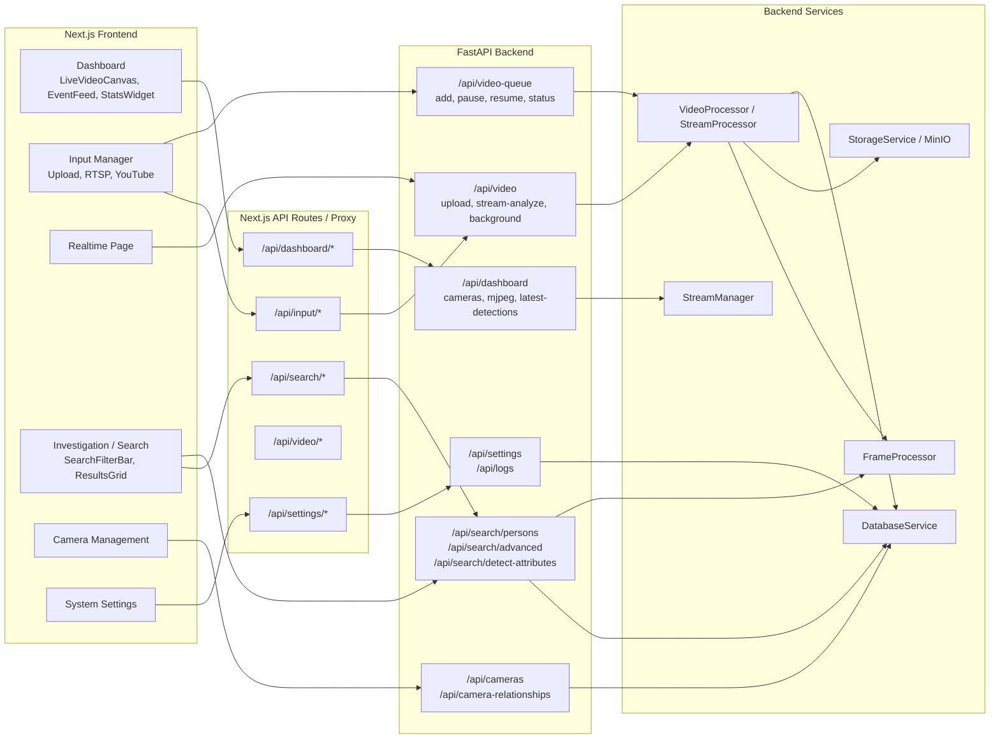

# ภาพที่ 3.12 แผนภาพการเชื่อมต่อหน้าจอ Frontend กับ Backend API

## คำอธิบายสำหรับใส่ในรายงาน

แผนภาพนี้ช่วยให้เห็นว่าแต่ละหน้าจอของ frontend เชื่อมต่อกับ API ใดบ้าง โดยบางส่วนเรียกผ่าน Next.js API route เพื่อทำหน้าที่ proxy ส่วนบางส่วนเรียก FastAPI โดยตรงผ่านค่า `NEXT_PUBLIC_API_URL` โครงสร้างนี้ทำให้ frontend แยกหน้าที่ชัดเจน เช่น Dashboard ใช้ API สำหรับข้อมูล realtime, Input Manager ใช้ API สำหรับเพิ่มงานวิดีโอหรือสตรีม, Investigation ใช้ Search API และ Camera Management ใช้ API สำหรับจัดการกล้อง
