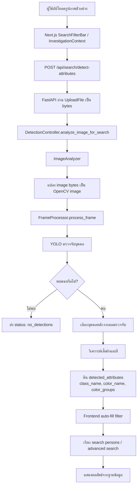

# ภาพที่ 3.13 Flow การค้นหาด้วยรูปภาพตัวอย่าง

## คำอธิบายสำหรับใส่ในรายงาน

แผนภาพนี้แสดง flow การค้นหาด้วยรูปภาพตัวอย่าง ระบบไม่ได้ใช้รูปภาพเพื่อยืนยันตัวตนแบบสมบูรณ์ แต่ใช้ `ImageAnalyzer` และ `FrameProcessor` เพื่อดึง attribute ที่มองเห็นได้ เช่น ประเภทเสื้อผ้า สีหลัก และกลุ่มสี จากนั้น frontend นำ attribute ที่ได้ไปเติมเป็นเงื่อนไขค้นหาอัตโนมัติ ช่วยให้ผู้ใช้เริ่มค้นหาได้เร็วขึ้นโดยไม่ต้องเลือกเงื่อนไขเองทั้งหมด
