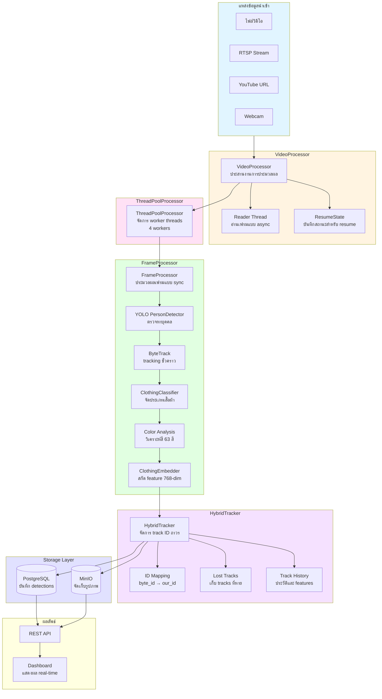

# ภาพที่ 3.1 สถาปัตยกรรมระบบ (System Architecture)

```mermaid
graph TB
    subgraph InputSources["แหล่งข้อมูลนำเข้า"]
        VideoFile[ไฟล์วิดีโอ]
        RTSP[RTSP Stream]
        YouTube[YouTube URL]
        Webcam[Webcam]
    end

    subgraph VideoProcessor["VideoProcessor"]
        VP[VideoProcessor<br/>ประสานงานการประมวลผล]
        ReaderThread[Reader Thread<br/>อ่านเฟรมแบบ async]
        ResumeState[ResumeState<br/>บันทึกสถานะสำหรับ resume]
    end

    subgraph ThreadPool["ThreadPoolProcessor"]
        TP[ThreadPoolProcessor<br/>จัดการ worker threads<br/>4 workers]
    end

    subgraph FrameProcessor["FrameProcessor"]
        FP[FrameProcessor<br/>ประมวลผลเฟรมแบบ sync]
        YOLO[YOLO PersonDetector<br/>ตรวจหาบุคคล]
        ByteTrack[ByteTrack<br/>tracking ชั่วคราว]
        Classifier[ClothingClassifier<br/>จัดประเภทเสื้อผ้า]
        ColorAnalyzer[Color Analysis<br/>วิเคราะห์สี 63 สี]
        Embedder[ClothingEmbedder<br/>สกัด feature 768-dim]
    end

    subgraph HybridTracker["HybridTracker"]
        HT[HybridTracker<br/>จัดการ track ID ถาวร]
        IDMapping[ID Mapping<br/>byte_id → our_id]
        LostTracks[Lost Tracks<br/>เก็บ tracks ที่หาย]
        TrackHistory[Track History<br/>ประวัติและ features]
    end

    subgraph Storage["Storage Layer"]
        DB[(PostgreSQL<br/>บันทึก detections)]
        MinIO[(MinIO<br/>จัดเก็บรูปภาพ)]
    end

    subgraph Output["ผลลัพธ์"]
        API[REST API]
        Dashboard[Dashboard<br/>แสดงผล real-time]
    end

    InputSources --> VP
    VP --> ReaderThread
    VP --> ResumeState
    VP --> TP
    TP --> FP
    FP --> YOLO
    YOLO --> ByteTrack
    ByteTrack --> Classifier
    Classifier --> ColorAnalyzer
    ColorAnalyzer --> Embedder
    Embedder --> HT
    HT --> IDMapping
    HT --> LostTracks
    HT --> TrackHistory
    HT --> DB
    HT --> MinIO
    DB --> API
    MinIO --> API
    API --> Dashboard

    style InputSources fill:#e1f5ff
    style VideoProcessor fill:#fff4e1
    style ThreadPool fill:#ffe1f5
    style FrameProcessor fill:#e1ffe1
    style HybridTracker fill:#f5e1ff
    style Storage fill:#e1e1ff
    style Output fill:#ffffe1
```
