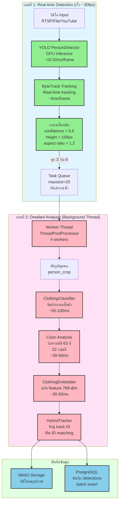

# ภาพที่ 3.2 Pipeline การประมวลผล 2 รอบ (Two-Round Processing Pipeline)

## คำอธิบาย:

**รอบที่ 1 (Round 1): Real-time Detection**
- ทำงานใน main loop แบบ real-time
- YOLO ตรวจหาบุคคลด้วย GPU (เร็ว ~10-20ms per frame)
- ByteTrack ทำ tracking แบบ real-time (เร็ว ~5ms per frame)
- กรอง detections ด้วย confidence, height, aspect ratio
- ส่งงานเข้า queue ทุก 3 วินาที (กันส่งซ้ำ)

**รอบที่ 2 (Round 2): Detailed Analysis**
- ทำงานใน background thread (ThreadPoolProcessor 4 workers)
- ตัดรูปบุคคล (person_crop)
- จัดประเภทเสื้อผ้า (ClothingClassifier)
- วิเคราะห์สี 63 สี แบ่งเป็น 22 กลุ่ม
- สกัด embedding 768-dim สำหรับ Re-ID
- HybridTracker จับคู่ track ID และกู้คืน lost tracks
- อัปโหลดรูปไป MinIO
- บันทึก detections ลง PostgreSQL (batch insert)
