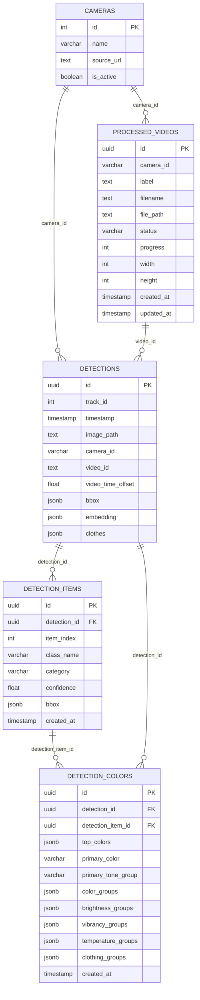

# ภาพที่ 3.9 แผนภาพความสัมพันธ์ของฐานข้อมูลหลัก (Database ERD)

## คำอธิบายสำหรับใส่ในรายงาน

แผนภาพนี้แสดงโครงสร้างข้อมูลหลักของระบบ โดย `detections` เป็นตารางกลางที่เก็บผลการตรวจจับบุคคลในระดับเฟรมหรือช่วงเวลา ส่วน `detection_items` ใช้แยกรายการเสื้อผ้าที่ตรวจพบในแต่ละบุคคล และ `detection_colors` ใช้เก็บข้อมูลสีของเสื้อผ้าแต่ละรายการ การแยกข้อมูลเสื้อผ้าและสีออกจากตาราง `detections` ทำให้ระบบรองรับการค้นหาแบบละเอียด เช่น เสื้อแขนยาวสีแดง หรือกางเกงขายาวสีน้ำเงิน ได้ดีกว่าการเก็บทุกอย่างรวมกันใน field เดียว

